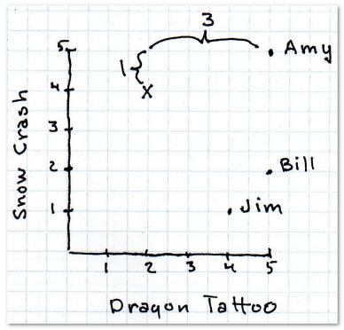
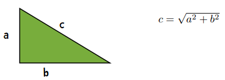
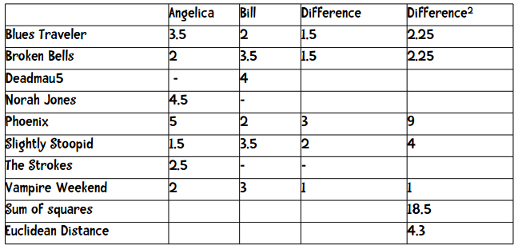
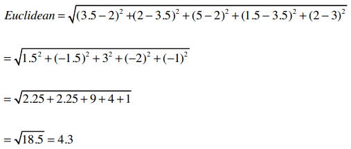
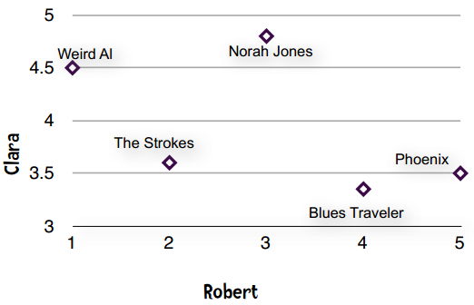
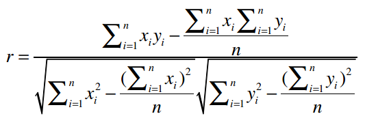
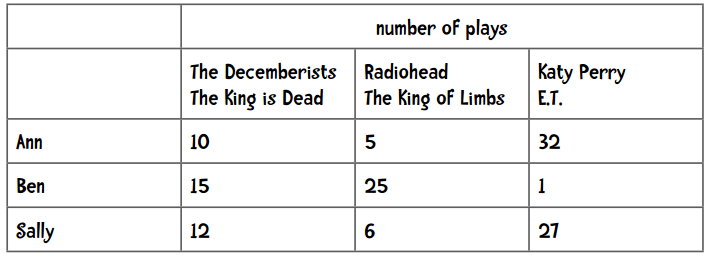

# 第二章：推荐系统入门

原文：http://guidetodatamining.com/chapter-2/

内容：
* 推荐系统工作原理
* 社会化协同过滤工作原理
* 如何找到相似物品
* 曼哈顿距离
* 欧几里得距离
* 闵可夫斯基距离
* 皮尔逊相关系数
* 余弦相似度
* 使用Python实现K最邻近算法
* 图书漂流站（BookCrossing）数据集

## 你喜欢的东西我也喜欢

我们将从推荐系统开始，开启数据挖掘之旅。推荐系统无处不在，如亚马逊网站的“看过这件商品的顾客还购买过”板块：


last.fm上对音乐和演唱会的推荐（相似歌手）：


在亚马逊的例子里，它用了两个元素来进行推荐：一是我浏览了里维斯翻译的《法华经》一书；二是其他浏览过该书的顾客还浏览过的译作。

本章我们讲述的推荐方法称为协同过滤。顾名思义，这个方法是利用他人的喜好来进行推荐，也就是说，是大家一起产生的推荐。他的工作原理是这样的：如果要推荐一本书给你，我会在网站上查找一个和你类似的用户，然后将他喜欢的书籍推荐给你——比如巴奇加卢比的《发条女孩》。

### 如何找到相似的用户？

所以首先要做的工作是找到相似的用户。这里用最简单的二维模型来描述。假设用户会在网站用五颗星来评价一本书——没有星表示书写得很糟，五颗星表示很好。因为我们用的是二维模型，所以仅对两本书进行评价：史蒂芬森的《雪崩》（纵轴）和拉尔森的《龙纹身的女孩》（横轴）。


首先，下表显示有三位用户对这两本书做了评价：


现在我想为神秘的X先生推荐一本书，他给《雪崩》打了四星，《龙纹身的女孩》两星。第一个任务是找出哪个用户和他最为相似。我们用距离来表示。

### 曼哈顿距离

最简单的距离计算方式是曼哈顿距离。在二维模型中，每个人都可以用(x, y)的点来表示，这里我用下标来表示不同的人，(x<sub>1</sub>, y<sub>1</sub>)表示艾米，(x<sub>2</sub>, y<sub>2</sub>)表示那位神秘的X先生，那么他们之间的曼哈顿距离就是：


也就是x之差的绝对值加上y之差的绝对值，这样他们的距离就是4。



完整的计算结果如下：


艾米的距离最近，在她的浏览历史中可以看到她曾给巴奇加卢比的《发条女孩》打过五星，于是我们就可以把这本书推荐给X先生。

### 欧几里得距离

曼哈顿距离的优点之一是计算速度快，对于Facebook这样需要计算百万用户之间的相似度时就非常有利。

**勾股定理**

也许你还隐约记得勾股定理。另一种计算距离的方式就是看两点之间的直线距离：


利用勾股定理，我们可以如下计算距离：



这条斜线就是欧几里得距离，公式是：


回顾一下，这里的x<sub>1</sub>表示用户1喜欢《龙纹身》的程度，x<sub>2</sub>是用户2喜欢这本书的程度；y<sub>1</sub>则是用户1喜欢《雪崩》的程度，y<sub>2</sub>是用户2喜欢这本书的程度。

艾米给《龙纹身》和《雪崩》都打了五颗星，神秘的X先生分别打了两星和四星，这样他们之间的欧几里得距离就是：


以下是全部用户的计算结果：


### N维模型

刚才我们仅仅对两本书进行评价（二维模型），下面让我们扩展一下，尝试更复杂的模型。假设我们现在要为一个在线音乐网站的用户推荐乐队。用户可以用1至5星来评价一个乐队，其中包含半星（如2.5星）。下表展示了8位用户对8支乐队的评价：


表中的短横表示这位用户没有给这支乐队打分。我们在计算两个用户的距离时，只采用他们都评价过的乐队，比如要计算Angelica和Bill的距离，我们只会用到5支乐队。这两个用户的曼哈顿距离为：


最后距离即是上方数据的加和：(1.5 + 1.5 + 3 + 2 + 1)。

计算欧几里得距离的方法也是类似的，我们也只取双方都评价过的乐队。



用公式来描述即：



**掌握了吗？** 那就试试计算其他几个用户之间的距离吧。


**有个瑕疵**

当我们计算Hailey和Veronica的距离时会发现一个问题：他们共同评价的乐队只有两支（Norah Jones和The Strokes），而Hailey和Jordyn共同评价了五支乐队，这似乎会影响我们的计算结果，因为Hailey和Veronica之间是二维的，而Haily和Veronica之间是五维的。曼哈顿距离和欧几里得距离在数据完整的情况下效果最好。如何处理缺失数据，这在研究领域仍是一个活跃的话题。本书的后续内容会进行一些讨论，这里先不展开。现在，让我们开始构建一个推荐系统吧。

### 推广：闵可夫斯基距离

我们可以将曼哈顿距离和欧几里得距离归纳成一个公式，这个公式称为闵可夫斯基距离：


其中：

* `r = 1` 该公式即曼哈顿距离
* `r = 2` 该公式即欧几里得距离
* `r = ∞` 极大距离


当你在书中看到这些数学公式，你可以选择快速略过它，继续读下面的文字，过去我就是这样；你也可以停下来，好好分析一下这些公式，会发现其实它们并不难理解。比如上面的公式，当r = 1时，可以简化成如下形式：


仍用上文的音乐站点为例，x和y分别表示两个用户，d(x, y)表示他们之间的距离，n表示他们共同评价过的乐队数量，我们之前已经做过计算：


其中Difference一栏表示两者评分之差的绝对值，加起来等于9，也就是他们之间的距离。

当r = 2时，我们得到欧几里得距离的计算公式：


**提前预告一下：r值越大，单个维度的差值大小会对整体距离有更大的影响。**


## 使用Python代码来表示数据（终于要开始编程了）

在Python中，我们可以用多种方式来描述上表中的数据，这里我选择Python的字典类型（或者称为关联数组、哈希表）。

注：本书的所有代码可以在[这里](code/)找到。

```python
users = {"Angelica": {"Blues Traveler": 3.5, "Broken Bells": 2.0, "Norah Jones": 4.5, "Phoenix": 5.0, "Slightly Stoopid": 1.5, "The Strokes": 2.5, "Vampire Weekend": 2.0},
         "Bill":{"Blues Traveler": 2.0, "Broken Bells": 3.5, "Deadmau5": 4.0, "Phoenix": 2.0, "Slightly Stoopid": 3.5, "Vampire Weekend": 3.0},
         "Chan": {"Blues Traveler": 5.0, "Broken Bells": 1.0, "Deadmau5": 1.0, "Norah Jones": 3.0, "Phoenix": 5, "Slightly Stoopid": 1.0},
         "Dan": {"Blues Traveler": 3.0, "Broken Bells": 4.0, "Deadmau5": 4.5, "Phoenix": 3.0, "Slightly Stoopid": 4.5, "The Strokes": 4.0, "Vampire Weekend": 2.0},
         "Hailey": {"Broken Bells": 4.0, "Deadmau5": 1.0, "Norah Jones": 4.0, "The Strokes": 4.0, "Vampire Weekend": 1.0},
         "Jordyn":  {"Broken Bells": 4.5, "Deadmau5": 4.0, "Norah Jones": 5.0, "Phoenix": 5.0, "Slightly Stoopid": 4.5, "The Strokes": 4.0, "Vampire Weekend": 4.0},
         "Sam": {"Blues Traveler": 5.0, "Broken Bells": 2.0, "Norah Jones": 3.0, "Phoenix": 5.0, "Slightly Stoopid": 4.0, "The Strokes": 5.0},
         "Veronica": {"Blues Traveler": 3.0, "Norah Jones": 5.0, "Phoenix": 4.0, "Slightly Stoopid": 2.5, "The Strokes": 3.0}
        }
```

我们可以用以下方式来获取某个用户的评分：

```python
>>> user["Veronica"]
{"Blues Traveler": 3.0, "Norah Jones": 5.0, "Phoenix": 4.0, "Slightly Stoopid": 2.5, "The Strokes": 3.0}
>>>
```

### 计算曼哈顿距离

```python
def manhattan(rating1, rating2):
    """计算曼哈顿距离。rating1和rating2参数中存储的数据格式均为
    {'The Strokes': 3.0, 'Slightly Stoopid': 2.5}"""
    distance = 0
    for key in rating1:
        if key in rating2:
            distance += abs(rating1[key] - rating2[key])
    return distance
```

我们可以做一下测试：

```python
>>> manhattan(users['Hailey'], users['Veronica'])
2.0
>>> manhattan(users['Hailey'], users['Jordyn'])
7.5
>>>
```

下面我们编写一个函数来找出距离最近的用户（其实该函数会返回一个用户列表，按距离排序）：

```python
def computeNearestNeighbor(username, users):
    """计算所有用户至username用户的距离，倒序排列并返回结果列表"""
    distances = []
    for user in users:
        if user != username:
            distance = manhattan(users[user], users[username])
            distances.append((distance, user))
    # 按距离排序——距离近的排在前面
    distances.sort()
    return distances
```

简单测试一下：

```python
>>> computeNearestNeighbor("Hailey", users)
[(2.0, 'Veronica'), (4.0, 'Chan'), (4.0, 'Sam'), (4.5, 'Dan'), (5.0, 'Angelica'), (5.5, 'Bill'), (7.5, 'Jordyn')]
```

最后，我们结合以上内容来进行推荐。假设我想为Hailey做推荐，这里我找到了离他距离最近的用户Veronica。然后，我会找到出Veronica评价过但Hailey没有评价的乐队，并假设Hailey对这些陌生乐队的评价会和Veronica相近。比如，Hailey没有评价过Phoenix乐队，而Veronica对这个乐队打出了4分，所以我们认为Hailey也会喜欢这支乐队。下面的函数就实现了这一逻辑：

```python
def recommend(username, users):
    """返回推荐结果列表"""
    # 找到距离最近的用户
    nearest = computeNearestNeighbor(username, users)[0][1]
    recommendations = []
    # 找出这位用户评价过、但自己未曾评价的乐队
    neighborRatings = users[nearest]
    userRatings = users[username]
    for artist in neighborRatings:
        if not artist in userRatings:
            recommendations.append((artist, neighborRatings[artist]))
    # 按照评分进行排序
    return sorted(recommendations, key=lambda artistTuple: artistTuple[1], reverse = True)
```

下面我们就可以用它来为Hailey做推荐了：

```python
>>> recommend('Hailey', users)
[('Phoenix', 4.0), ('Blues Traveler', 3.0), ('Slightly Stoopid', 2.5)]
```

运行结果和我们的预期相符。我们看可以看到，和Hailey距离最近的用户是Veronica，Veronica对Phoenix乐队打了4分。我们再试试其他人：

```python
>>> recommend('Chan', users)
[('The Strokes', 4.0), ('Vampire Weekend', 1.0)]
>>> recommend('Sam', users)
[('Deadmau5', 1.0)]
```

我们可以猜想Chan会喜欢The Strokes乐队，而Sam不会太欣赏Deadmau5。

```python
>>> recommend('Angelica', users)
[]
```

对于Angelica，我们得到了空的返回值，也就是说我们无法对其进行推荐。让我们看看是哪里有问题：

```python
>>> computeNearestNeighbor('Angelica', users)
[(3.5, 'Veronica'), (4.5, 'Chan'), (5.0, 'Hailey'), (8.0, 'Sam'), (9.0, 'Bill'), (9.0, 'Dan'), (9.5, 'Jordyn')]
```

Angelica最相似的用户是Veronica，让我们回头看看数据：


我们可以看到，Veronica评价过的乐队，Angelica也都评价过了，所以我们没有推荐。

之后，我们会讨论如何解决这一问题。

**作业：实现一个计算闵可夫斯基距离的函数，并在计算用户距离时使用它。**

```python
def minkowski(rating1, rating2, r):
    distance = 0
    for key in rating1:
        if key in rating2:
            distance += pow(abs(rating1[key] - rating2[key]), r)
    return pow(distance, 1.0 / r)

# 修改computeNearestNeighbor函数中的一行
distance = minkowski(users[user], users[username], 2)
# 这里2表示使用欧几里得距离
```

### 用户的问题

让我们仔细看看用户对乐队的评分，可以发现每个用户的打分标准非常不同：

* Bill没有打出极端的分数，都在2至4分之间；
* Jordyn似乎喜欢所有的乐队，打分都在4至5之间；
* Hailey是一个有趣的人，他的分数不是1就是4。

那么，如何比较这些用户呢？比如Hailey的4分相当于Jordan的4分还是5分呢？我觉得更接近5分。这样一来就会影响到推荐系统的准确性了。


* 左：我非常喜欢Broken Bells乐队，所以我给他们打4分！
* 右：Broken Bells乐队还可以，我打4分。

### 皮尔逊相关系数

解决方法之一是使用皮尔逊相关系数。简单起见，我们先看下面的数据（和之前的数据不同）：


这种现象在数据挖掘领域称为“分数膨胀”。Clara最低给了4分——她所有的打分都在4至5分之间。我们将它绘制成图表：


**一条直线——完全吻合！！！**

直线即表示Clara和Robert的偏好完全一致。他们都认为Phoenix是最好的乐队，然后是Blues Traveler、Norah Jones。如果Clara和Robert的意见不一致，那么落在直线上的点就越少。

**意见基本一致的情形**


**意见不太一致的情形**



所以从图表上理解，意见相一致表现为一条直线。皮尔逊相关系数用于衡量两个变量之间的相关性（这里的两个变量指的是Clara和Robert），它的值在-1至1之间，1表示完全吻合，-1表示完全相悖。从直观上理解，最开始的那条直线皮尔逊相关系数为1，第二张是0.91，第三张是0.81。因此我们利用这一点来找到相似的用户。

皮尔逊相关系数的计算公式是：


这里我说说自己的经历。我大学读的是现代音乐艺术，课程包括芭蕾、现代舞、服装设计等，没有任何数学课程。我高中读的是男子学校，学习了管道工程和汽车维修，只懂得很基础的数学知识。不知是因为我的学科背景，还是习惯于用直觉来思考，当我遇到这样的数学公式时会习惯性地跳过，继续读下面的文字。如果你和我一样，我强烈建议你与这种惰性抗争，试着去理解这些公式。它们虽然看起来很复杂，但还是能够被常人所理解的。

上面的公式除了看起来比较复杂，另一个问题是要获得计算结果必须对数据做多次遍历。好在我们有另外一个公式，能够计算皮尔逊相关系数的近似值：



这个公式虽然看起来更加复杂，而且其计算结果会不太稳定，有一定误差存在，但它最大的优点是，用代码实现的时候可以只遍历一次数据，我们会在下文看到。首先，我们将这个公式做一个分解，计算下面这个表达式的值：


对于Clara和Robert，我们可以得到：


很简单把？下面我们计算这个公式：


Clara的总评分是22.5， Robert是15，他们评价了5支乐队，因此：


所以，那个巨型公式的分子就是70 - 67.5 = 2.5。

下面我们来看分母：


首先：


我们已经计算过Clara的总评分是22.5，它的平方是506.25，除以乐队的数量5，得到101.25。综合得到：


对于Robert，我们用同样的方法计算：


最后得到：


因此，1表示Clara和Robert的偏好完全吻合。

**先休息一下吧**


**计算皮尔逊相关系数的代码**

```python
from math import sqrt

def pearson(rating1, rating2):
    sum_xy = 0
    sum_x = 0
    sum_y = 0
    sum_x2 = 0
    sum_y2 = 0
    n = 0
    for key in rating1:
        if key in rating2:
            n += 1
            x = rating1[key]
            y = rating2[key]
            sum_xy += x * y
            sum_x += x
            sum_y += y
            sum_x2 += pow(x, 2)
            sum_y2 += pow(y, 2)
    # 计算分母
    denominator = sqrt(sum_x2 - pow(sum_x, 2) / n) * sqrt(sum_y2 - pow(sum_y, 2) / n)
    if denominator == 0:
        return 0
    else:
        return (sum_xy - (sum_x * sum_y) / n) / denominator
```

测试一下：

```python
>>> pearson(users['Angelica'], users['Bill'])
-0.9040534990682699
>>> pearson(users['Angelica'], users['Hailey'])
0.42008402520840293
>>> pearson(users['Angelica'], users['Jordyn'])
0.7639748605475432
```

## 最后一个公式：余弦相似度

这里我将奉上最后一个公式：余弦相似度。它在文本挖掘中应用得较多，在协同过滤中也会使用到。为了演示如何使用该公式，我们换一个示例。这里记录了每个用户播放歌曲的次数，我们用这些数据进行推荐：



简单扫一眼上面的数据（或者用之前讲过的距离计算公式），我们可以发现Ann的偏好和Sally更为相似。

**问题在哪儿？**

我在iTunes上有大约4000首歌曲，下面是我最常听的音乐：


可以看到，Moonlight Sonata这首歌我播放了25次，但很有可能你一次都没有听过。事实上，上面列出的这些歌曲可能你一首都没听过。此外，iTunes上有1500万首音乐，而我只听过4000首。所以说单个用户的数据是 *稀疏* 的，因为非零值较总体要少得多。当我们用1500万首歌曲来比较两个用户时，很有可能他们之间没有任何交集，这样一来就无从计算他们之间的距离了。


类似的情况是在计算两篇文章的相似度时。比如说我们想找一本和《The Space Pioneers》相类似的书，方法之一是利用单词出现的频率，即统计每个单词在书中出现的次数占全书单词的比例，如“the”出现频率为6.13%，“Tom” 0.89%，“space” 0.25%。我们可以用这些数据来寻找一本相近的书。但是，这里同样有数据的稀疏性问题。《The Space Pioneers》中有6629个不同的单词，但英语语言中有超过100万个单词，这样一来非零值就很稀少了，也就不能计算两本书之间的距离。

余弦相似度的计算中会略过这些非零值。它的计算公式是：


其中，“·”号表示数量积。“||x||”表示向量x的模，计算公式是：


我们用上文中“偏好完全一致”的示例：


所以两个向量为：


它们的模是：


数量积的计算：


因此余弦相似度是：


余弦相似度的范围从1到-1，1表示完全匹配，-1表示完全相悖。所以0.935表示匹配度很高。

**作业：尝试计算Angelica和Veronica的余弦相似度**

### 应该使用哪种相似度？

我们整本书都会探索这个问题，以下是一些提示：


* 如果数据存在“分数膨胀”问题，就使用皮尔逊相关系数。
* 如果数据比较“密集”，变量之间基本都存在公有值，且这些距离数据是非常重要的，那就使用欧几里得或曼哈顿距离。
* 如果数据是稀疏的，则使用余弦相似度。

所以，如果数据是密集的，曼哈顿距离和欧几里得距离都是适用的。那么稀疏的数据可以使用吗？我们来看一个也和音乐有关的示例：假设有三个人，每人都给100首音乐评过分。


* Jake（左）：乡村音乐的忠实听众。
* Linda和Eric（右）：我们爱六十年代的摇滚乐！

Linda和Eric喜欢相同的音乐，他们的评分列表中有20首相同的的歌曲，且评分均值相差不到0.5！所以他们之间的曼哈顿距离为20 x 0.5 = 10，欧几里得距离则为：


Linda和Jake只共同评分了一首歌曲：Chris Cagle的 *What a Beautiful Day* 。Linda打了3分，Jake打了5分，所以他们之间的曼哈顿距离为2，欧几里得距离为：


所以不管是曼哈顿距离还是欧几里得距离，Jake都要比Eric离Linda近，这不符合实际情况。


> 嘿，我想到一个办法。人们给音乐打分是从1到5分，那些没有打分的音乐就统一给0分好了，这样就能解决数据稀疏的问题了！

想法不错，但是这样做也不行。为了解释这一问题，我们再引入两个人到例子里来：Cooper和Kelsey。他们和Jake都有着非常相似的音乐偏好，其中Jake在我们网站上评价了25首歌曲。


Cooper评价了26首歌曲，其中25首和Jake是一样的。他们对每首歌曲的评价差值只有0.25！

Kelsey在我们网站上评价了150首歌曲，其中25首和Jake相同。和Cooper一样，她和Jake之间的评价差值也只有0.25！

所以我们从直觉上看Cooper和Keylsey离Jake的距离应该相似。但是，当我们计算他们之间的曼哈顿距离和欧几里得距离时（代入0值），会发现Cooper要比Keylsey离Jake近得多。

**为什么呢？**

我们来看下面的数据：


从4、5、6这三首歌来看，两人离Jake的距离是相同的，但计算出的曼哈顿距离却不这么显示：


问题就在于数据中的0值对结果的影响很大，所以用0代替空值的方法并不比原来的方程好。还有一种变通的方式是计算“平均值”——将两人共同评价过的歌曲分数除以歌曲数量。

总之，曼哈顿距离和欧几里得距离在数据完整的情况下会运作得非常好，如果数据比较稀疏，则要考虑使用余弦距离。

### 古怪的现象

假设我们要为Amy推荐乐队，她喜欢Phoenix、Passion Pit、以及Vampire Weekend。和她最相似的用户是Bob，他也喜欢这三支乐队。他的父亲为Walter Ostanek乐队演奏手风琴，所以受此影响，他给了这支乐队5星评价。按照我们现在的推荐逻辑，我们会将这支乐队推荐给Amy，但有可能她并不喜欢。


或者试想一下，Billy Bob Olivera教授喜欢阅读数据挖掘方面的书籍以及科幻小说，他最邻近的用户是我，因为我也喜欢这两种书。然而，我又是一个贵宾犬的爱好者，所以给《贵宾犬的隐秘生活》这本书打了很高的分。这样一来，现有的推荐方法会将这本书介绍给Olivera教授。


问题就在于我们只依靠最相似的 **一个** 用户来做推荐，如果这个用户有些特殊的偏好，就会直接反映在推荐内容里。解决方法之一是找寻多个相似的用户，这里就要用到K最邻近算法了。

### K最邻近算法

在协同过滤中可以使用K最邻近算法来找出K个最相似的用户，以此作为推荐的基础。不同的应用有不同的K值，需要做一些实验来得出。以下给到读者一个基本的思路。

假设我要为Ann做推荐，并令K=3。使用皮尔逊相关系数得到的结果是：


这三个人都会对推荐结果有所贡献，问题在于我们如何确定他们的比重呢？我们直接用相关系数的比重来描述，Sally的比重是0.8/2=40%，Eric是0.7/2=35%，Amanda则是25%：


假设他们三人对Grey Wardens的评分以及加权后的结果如下：


最后计算得到的分数为：


## Python推荐模块

我将本章学到的内容都汇集成了一个Pyhont类，虽然代码有些长，我还是贴在了这里：

```python
import codecs 
from math import sqrt

users = {"Angelica": {"Blues Traveler": 3.5, "Broken Bells": 2.0,
                      "Norah Jones": 4.5, "Phoenix": 5.0,
                      "Slightly Stoopid": 1.5,
                      "The Strokes": 2.5, "Vampire Weekend": 2.0},
         
         "Bill":{"Blues Traveler": 2.0, "Broken Bells": 3.5,
                 "Deadmau5": 4.0, "Phoenix": 2.0,
                 "Slightly Stoopid": 3.5, "Vampire Weekend": 3.0},
         
         "Chan": {"Blues Traveler": 5.0, "Broken Bells": 1.0,
                  "Deadmau5": 1.0, "Norah Jones": 3.0, "Phoenix": 5,
                  "Slightly Stoopid": 1.0},
         
         "Dan": {"Blues Traveler": 3.0, "Broken Bells": 4.0,
                 "Deadmau5": 4.5, "Phoenix": 3.0,
                 "Slightly Stoopid": 4.5, "The Strokes": 4.0,
                 "Vampire Weekend": 2.0},
         
         "Hailey": {"Broken Bells": 4.0, "Deadmau5": 1.0,
                    "Norah Jones": 4.0, "The Strokes": 4.0,
                    "Vampire Weekend": 1.0},
         
         "Jordyn":  {"Broken Bells": 4.5, "Deadmau5": 4.0,
                     "Norah Jones": 5.0, "Phoenix": 5.0,
                     "Slightly Stoopid": 4.5, "The Strokes": 4.0,
                     "Vampire Weekend": 4.0},
         
         "Sam": {"Blues Traveler": 5.0, "Broken Bells": 2.0,
                 "Norah Jones": 3.0, "Phoenix": 5.0,
                 "Slightly Stoopid": 4.0, "The Strokes": 5.0},
         
         "Veronica": {"Blues Traveler": 3.0, "Norah Jones": 5.0,
                      "Phoenix": 4.0, "Slightly Stoopid": 2.5,
                      "The Strokes": 3.0}
        }


class recommender:

    def __init__(self, data, k=1, metric='pearson', n=5):
        """ 初始化推荐模块
        data   训练数据
        k      K邻近算法中的值
        metric 使用何种距离计算方式
        n      推荐结果的数量
        """
        self.k = k
        self.n = n
        self.username2id = {}
        self.userid2name = {}
        self.productid2name = {}
        # 将距离计算方式保存下来
        self.metric = metric
        if self.metric == 'pearson':
            self.fn = self.pearson
        #
        # 如果data是一个字典类型，则保存下来，否则忽略
        #
        if type(data).__name__ == 'dict':
            self.data = data

    def convertProductID2name(self, id):
        """通过产品ID获取名称"""
        if id in self.productid2name:
            return self.productid2name[id]
        else:
            return id

    def userRatings(self, id, n):
        """返回该用户评分最高的物品"""
        print ("Ratings for " + self.userid2name[id])
        ratings = self.data[id]
        print(len(ratings))
        ratings = list(ratings.items())
        ratings = [(self.convertProductID2name(k), v)
                   for (k, v) in ratings]
        # 排序并返回结果
        ratings.sort(key=lambda artistTuple: artistTuple[1],
                     reverse = True)
        ratings = ratings[:n]
        for rating in ratings:
            print("%s\t%i" % (rating[0], rating[1]))

    def loadBookDB(self, path=''):
        """加载BX数据集，path是数据文件位置"""
        self.data = {}
        i = 0
        #
        # 将书籍评分数据放入self.data
        #
        f = codecs.open(path + "BX-Book-Ratings.csv", 'r', 'utf8')
        for line in f:
            i += 1
            #separate line into fields
            fields = line.split(';')
            user = fields[0].strip('"')
            book = fields[1].strip('"')
            rating = int(fields[2].strip().strip('"'))
            if user in self.data:
                currentRatings = self.data[user]
            else:
                currentRatings = {}
            currentRatings[book] = rating
            self.data[user] = currentRatings
        f.close()
        #
        # 将书籍信息存入self.productid2name
        # 包括isbn号、书名、作者等
        #
        f = codecs.open(path + "BX-Books.csv", 'r', 'utf8')
        for line in f:
            i += 1
            #separate line into fields
            fields = line.split(';')
            isbn = fields[0].strip('"')
            title = fields[1].strip('"')
            author = fields[2].strip().strip('"')
            title = title + ' by ' + author
            self.productid2name[isbn] = title
        f.close()
        #
        #  将用户信息存入self.userid2name和self.username2id
        #
        f = codecs.open(path + "BX-Users.csv", 'r', 'utf8')
        for line in f:
            i += 1
            #print(line)
            #separate line into fields
            fields = line.split(';')
            userid = fields[0].strip('"')
            location = fields[1].strip('"')
            if len(fields) > 3:
                age = fields[2].strip().strip('"')
            else:
                age = 'NULL'
            if age != 'NULL':
                value = location + '  (age: ' + age + ')'
            else:
                value = location
            self.userid2name[userid] = value
            self.username2id[location] = userid
        f.close()
        print(i)

    def pearson(self, rating1, rating2):
        sum_xy = 0
        sum_x = 0
        sum_y = 0
        sum_x2 = 0
        sum_y2 = 0
        n = 0
        for key in rating1:
            if key in rating2:
                n += 1
                x = rating1[key]
                y = rating2[key]
                sum_xy += x * y
                sum_x += x
                sum_y += y
                sum_x2 += pow(x, 2)
                sum_y2 += pow(y, 2)
        if n == 0:
            return 0
        # 计算分母
        denominator = (sqrt(sum_x2 - pow(sum_x, 2) / n)
                       * sqrt(sum_y2 - pow(sum_y, 2) / n))
        if denominator == 0:
            return 0
        else:
            return (sum_xy - (sum_x * sum_y) / n) / denominator

    def computeNearestNeighbor(self, username):
        """获取邻近用户"""
        distances = []
        for instance in self.data:
            if instance != username:
                distance = self.fn(self.data[username],
                                   self.data[instance])
                distances.append((instance, distance))
        # 按距离排序，距离近的排在前面
        distances.sort(key=lambda artistTuple: artistTuple[1],
                       reverse=True)
        return distances

    def recommend(self, user):
       """返回推荐列表"""
       recommendations = {}
       # 首先，获取邻近用户
       nearest = self.computeNearestNeighbor(user)
       #
       # 获取用户评价过的商品
       #
       userRatings = self.data[user]
       #
       # 计算总距离
       totalDistance = 0.0
       for i in range(self.k):
          totalDistance += nearest[i][1]
       # 汇总K邻近用户的评分
       for i in range(self.k):
          # 计算饼图的每个分片
          weight = nearest[i][1] / totalDistance
          # 获取用户名称
          name = nearest[i][0]
          # 获取用户评分
          neighborRatings = self.data[name]
          # 获得没有评价过的商品
          for artist in neighborRatings:
             if not artist in userRatings:
                if artist not in recommendations:
                   recommendations[artist] = (neighborRatings[artist]
                                              * weight)
                else:
                   recommendations[artist] = (recommendations[artist]
                                              + neighborRatings[artist]
                                              * weight)
       # 开始推荐
       recommendations = list(recommendations.items())
       recommendations = [(self.convertProductID2name(k), v)
                          for (k, v) in recommendations]
       # 排序并返回
       recommendations.sort(key=lambda artistTuple: artistTuple[1],
                            reverse = True)
       # 返回前n个结果
       return recommendations[:self.n]
```

**运行示例**

首先构建一个推荐类，然后获取推荐结果：

```python
>>> r = recommender(users)
>>> r.recommend('Jordyn')
[('Blues Traveler', 5.0)]
>>> r.recommend('Hailey')
[('Phoenix', 5.0), ('Slightly Stoopid', 4.5)]
```
