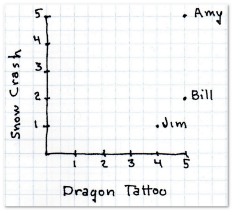
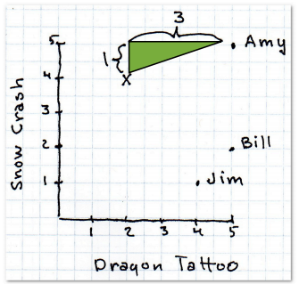
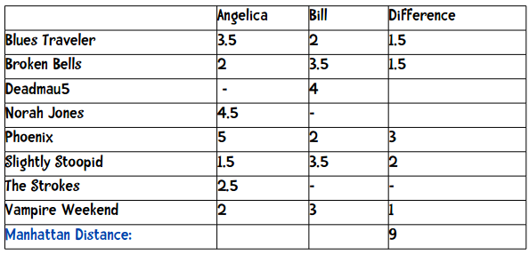
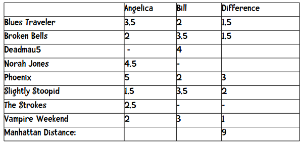

# 第二章：推荐系统入门

原文：http://guidetodatamining.com/chapter-2/

内容：
* 推荐系统工作原理
* 社会化协同过滤工作原理
* 如何找到相似物品
* 曼哈顿距离
* 欧几里得距离
* 闵可夫斯基距离
* 皮尔逊相关系数
* 余弦相似度
* 使用Python实现K最邻近算法
* 图书漂流站（BookCrossing）数据集

## 你喜欢的东西我也喜欢

我们将从推荐系统开始，开启数据挖掘之旅。推荐系统无处不在，如亚马逊网站的“看过这件商品的顾客还购买过”板块：


last.fm上对音乐和演唱会的推荐（相似歌手）：


在亚马逊的例子里，它用了两个元素来进行推荐：一是我浏览了里维斯翻译的《法华经》一书；二是其他浏览过该书的顾客还浏览过的译作。

本章我们讲述的推荐方法称为协同过滤。顾名思义，这个方法是利用他人的喜好来进行推荐，也就是说，是大家一起产生的推荐。他的工作原理是这样的：如果要推荐一本书给你，我会在网站上查找一个和你类似的用户，然后将他喜欢的书籍推荐给你——比如巴奇加卢比的《发条女孩》。

### 如何找到相似的用户？

所以首先要做的工作是找到相似的用户。这里用最简单的二维模型来描述。假设用户会在网站用五颗星来评价一本书——没有星表示书写得很糟，五颗星表示很好。因为我们用的是二维模型，所以仅对两本书进行评价：史蒂芬森的《雪崩》（纵轴）和拉尔森的《龙纹身的女孩》（横轴）。



首先，下表显示有三位用户对这两本书做了评价：


现在我想为神秘的X先生推荐一本书，他给《雪崩》打了四星，《龙纹身的女孩》两星。第一个任务是找出哪个用户和他最为相似。我们用距离来表示。

### 曼哈顿距离

最简单的距离计算方式是曼哈顿距离。在二维模型中，每个人都可以用(x, y)的点来表示，这里我用下标来表示不同的人，(x<sub>1</sub>, y<sub>1</sub>)表示艾米，(x<sub>2</sub>, y<sub>2</sub>)表示那位神秘的X先生，那么他们之间的曼哈顿距离就是：


也就是x之差的绝对值加上y之差的绝对值，这样他们的距离就是4。


完整的计算结果如下：


艾米的距离最近，在她的浏览历史中可以看到她曾给巴奇加卢比的《发条女孩》打过五星，于是我们就可以把这本书推荐给X先生。

### 欧几里得距离

曼哈顿距离的优点之一是计算速度快，对于Facebook这样需要计算百万用户之间的相似度时就非常有利。

**勾股定理**

也许你还隐约记得勾股定理。另一种计算距离的方式就是看两点之间的直线距离：



利用勾股定理，我们可以如下计算距离：


这条斜线就是欧几里得距离，公式是：


回顾一下，这里的x<sub>1</sub>表示用户1喜欢《龙纹身》的程度，x<sub>2</sub>是用户2喜欢这本书的程度；y<sub>1</sub>则是用户1喜欢《雪崩》的程度，y<sub>2</sub>是用户2喜欢这本书的程度。

艾米给《龙纹身》和《雪崩》都打了五颗星，神秘的X先生分别打了两星和四星，这样他们之间的欧几里得距离就是：


以下是全部用户的计算结果：


### N维模型

刚才我们仅仅对两本书进行评价（二维模型），下面让我们扩展一下，尝试更复杂的模型。假设我们现在要为一个在线音乐网站的用户推荐乐队。用户可以用1至5星来评价一个乐队，其中包含半星（如2.5星）。下表展示了8位用户对8支乐队的评价：


表中的短横表示这位用户没有给这支乐队打分。我们在计算两个用户的距离时，只采用他们都评价过的乐队，比如要计算Angelica和Bill的距离，我们只会用到5支乐队。这两个用户的曼哈顿距离为：



最后距离即是上方数据的加和：(1.5 + 1.5 + 3 + 2 + 1)。

计算欧几里得距离的方法也是类似的，我们也只取双方都评价过的乐队。


用公式来描述即：


**掌握了吗？** 那就试试计算其他几个用户之间的距离吧。


**有个瑕疵**

当我们计算Hailey和Veronica的距离时会发现一个问题：他们共同评价的乐队只有两支（Norah Jones和The Strokes），而Hailey和Jordyn共同评价了五支乐队，这似乎会影响我们的计算结果，因为Hailey和Veronica之间是二维的，而Haily和Veronica之间是五维的。曼哈顿距离和欧几里得距离在数据完整的情况下效果最好。如何处理缺失数据，这在研究领域仍是一个活跃的话题。本书的后续内容会进行一些讨论，这里先不展开。现在，让我们开始构建一个推荐系统吧。

### 推广：闵可夫斯基距离

我们可以将曼哈顿距离和欧几里得距离归纳成一个公式，这个公式称为闵可夫斯基距离：


其中：

* `r = 1` 该公式即曼哈顿距离
* `r = 2` 该公式即欧几里得距离
* `r = ∞` 极大距离


当你在书中看到这些数学公式，你可以选择快速略过它，继续读下面的文字，过去我就是这样；你也可以停下来，好好分析一下这些公式，会发现其实它们并不难理解。比如上面的公式，当r = 1时，可以简化成如下形式：


仍用上文的音乐站点为例，x和y分别表示两个用户，d(x, y)表示他们之间的距离，n表示他们共同评价过的乐队数量，我们之前已经做过计算：



其中Difference一栏表示两者评分之差的绝对值，加起来等于9，也就是他们之间的距离。

当r = 2时，我们得到欧几里得距离的计算公式：


**提前预告一下：r值越大，单个维度的差值大小会对整体距离有更大的影响。**


## 使用Python代码来表示数据（终于要开始编程了）

在Python中，我们可以用多种方式来描述上表中的数据，这里我选择Python的字典类型（或者称为关联数组、哈希表）。

注：本书的所有代码可以在[这里](code/)找到。

```python
users = {"Angelica": {"Blues Traveler": 3.5, "Broken Bells": 2.0, "Norah Jones": 4.5, "Phoenix": 5.0, "Slightly Stoopid": 1.5, "The Strokes": 2.5, "Vampire Weekend": 2.0},
         "Bill":{"Blues Traveler": 2.0, "Broken Bells": 3.5, "Deadmau5": 4.0, "Phoenix": 2.0, "Slightly Stoopid": 3.5, "Vampire Weekend": 3.0},
         "Chan": {"Blues Traveler": 5.0, "Broken Bells": 1.0, "Deadmau5": 1.0, "Norah Jones": 3.0, "Phoenix": 5, "Slightly Stoopid": 1.0},
         "Dan": {"Blues Traveler": 3.0, "Broken Bells": 4.0, "Deadmau5": 4.5, "Phoenix": 3.0, "Slightly Stoopid": 4.5, "The Strokes": 4.0, "Vampire Weekend": 2.0},
         "Hailey": {"Broken Bells": 4.0, "Deadmau5": 1.0, "Norah Jones": 4.0, "The Strokes": 4.0, "Vampire Weekend": 1.0},
         "Jordyn":  {"Broken Bells": 4.5, "Deadmau5": 4.0, "Norah Jones": 5.0, "Phoenix": 5.0, "Slightly Stoopid": 4.5, "The Strokes": 4.0, "Vampire Weekend": 4.0},
         "Sam": {"Blues Traveler": 5.0, "Broken Bells": 2.0, "Norah Jones": 3.0, "Phoenix": 5.0, "Slightly Stoopid": 4.0, "The Strokes": 5.0},
         "Veronica": {"Blues Traveler": 3.0, "Norah Jones": 5.0, "Phoenix": 4.0, "Slightly Stoopid": 2.5, "The Strokes": 3.0}
        }
```

我们可以用以下方式来获取某个用户的评分：

```python
>>> user["Veronica"]
{"Blues Traveler": 3.0, "Norah Jones": 5.0, "Phoenix": 4.0, "Slightly Stoopid": 2.5, "The Strokes": 3.0}
>>>
```

### 计算曼哈顿距离

```python
def manhattan(rating1, rating2):
    """计算曼哈顿距离。rating1和rating2参数中存储的数据格式均为
    {'The Strokes': 3.0, 'Slightly Stoopid': 2.5}"""
    distance = 0
    for key in rating1:
        if key in rating2:
            distance += abs(rating1[key] - rating2[key])
    return distance
```

我们可以做一下测试：

```python
>>> manhattan(users['Hailey'], users['Veronica'])
2.0
>>> manhattan(users['Hailey'], users['Jordyn'])
7.5
>>>
```

下面我们编写一个函数来找出距离最近的用户（其实该函数会返回一个用户列表，按距离排序）：

```python
def computeNearestNeighbor(username, users):
    """计算所有用户至username用户的距离，倒序排列并返回结果列表"""
    distances = []
    for user in users:
        if user != username:
            distance = manhattan(users[user], users[username])
            distances.append((distance, user))
    # 按距离排序——距离近的排在前面
    distances.sort()
    return distances
```

简单测试一下：

```python
>>> computeNearestNeighbor("Hailey", users)
[(2.0, 'Veronica'), (4.0, 'Chan'), (4.0, 'Sam'), (4.5, 'Dan'), (5.0, 'Angelica'), (5.5, 'Bill'), (7.5, 'Jordyn')]
```

最后，我们结合以上内容来进行推荐。假设我想为Hailey做推荐，这里我找到了离他距离最近的用户Veronica。然后，我会找到出Veronica评价过但Hailey没有评价的乐队，并假设Hailey对这些陌生乐队的评价会和Veronica相近。比如，Hailey没有评价过Phoenix乐队，而Veronica对这个乐队打出了4分，所以我们认为Hailey也会喜欢这支乐队。下面的函数就实现了这一逻辑：

```python
def recommend(username, users):
    """返回推荐结果列表"""
    # 找到距离最近的用户
    nearest = computeNearestNeighbor(username, users)[0][1]
    recommendations = []
    # 找出这位用户评价过、但自己未曾评价的乐队
    neighborRatings = users[nearest]
    userRatings = users[username]
    for artist in neighborRatings:
        if not artist in userRatings:
            recommendations.append((artist, neighborRatings[artist]))
    # 按照评分进行排序
    return sorted(recommendations, key=lambda artistTuple: artistTuple[1], reverse = True)
```

下面我们就可以用它来为Hailey做推荐了：

```python
>>> recommend('Hailey', users)
[('Phoenix', 4.0), ('Blues Traveler', 3.0), ('Slightly Stoopid', 2.5)]
```

运行结果和我们的预期相符。我们看可以看到，和Hailey距离最近的用户是Veronica，Veronica对Phoenix乐队打了4分。我们再试试其他人：

```python
>>> recommend('Chan', users)
[('The Strokes', 4.0), ('Vampire Weekend', 1.0)]
>>> recommend('Sam', users)
[('Deadmau5', 1.0)]
```

我们可以猜想Chan会喜欢The Strokes乐队，而Sam不会太欣赏Deadmau5。

```python
>>> recommend('Angelica', users)
[]
```

对于Angelica，我们得到了空的返回值，也就是说我们无法对其进行推荐。让我们看看是哪里有问题：

```python
>>> computeNearestNeighbor('Angelica', users)
[(3.5, 'Veronica'), (4.5, 'Chan'), (5.0, 'Hailey'), (8.0, 'Sam'), (9.0, 'Bill'), (9.0, 'Dan'), (9.5, 'Jordyn')]
```

Angelica最相似的用户是Veronica，让我们回头看看数据：


我们可以看到，Veronica评价过的乐队，Angelica也都评价过了，所以我们没有推荐。

之后，我们会讨论如何解决这一问题。

**作业：实现一个计算闵可夫斯基距离的函数，并在计算用户距离时使用它。**

```python
def minkowski(rating1, rating2, r):
    distance = 0
    for key in rating1:
        if key in rating2:
            distance += pow(abs(rating1[key] - rating2[key]), r)
    return pow(distance, 1.0 / r)

# 修改computeNearestNeighbor函数中的一行
distance = minkowski(users[user], users[username], 2)
# 这里2表示使用欧几里得距离
```
