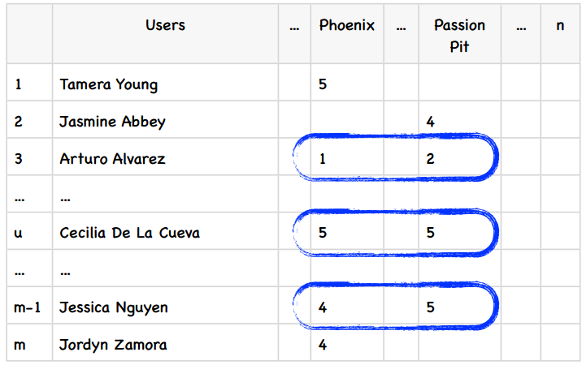
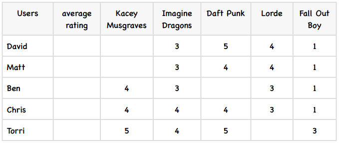
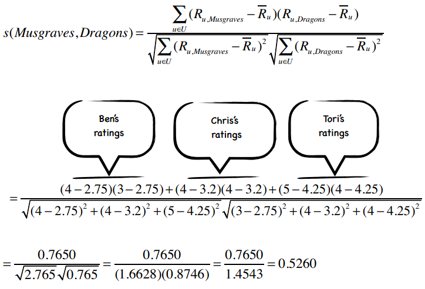
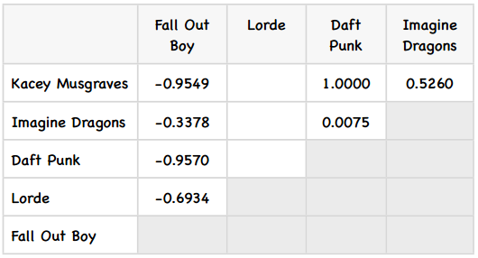
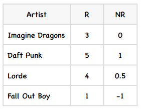
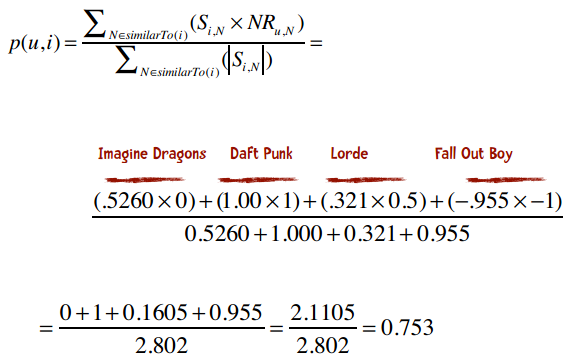
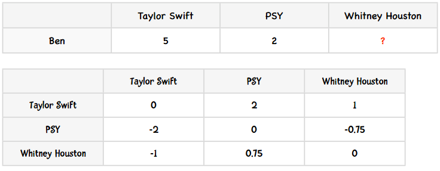

# 第三章：隐式评价和基于物品的过滤算法

原文：http://guidetodatamining.com/chapter-3/

本章会从用户的评价类型开始讨论，包括显式评价（赞一下、踩一脚、五星评价等等）和隐式评价（比如在亚马逊上购买了MP3，我们可以认为他喜欢这个产品）。

内容：

* 显式评价
* 隐式评价
* 哪种评价方式更准确？
* 基于用户的协同过滤
* 基于物品的协同过滤
* 修正的余弦相似度
* Slope One算法
* Slope One的Python实现
* MovieLens数据

第二章中我们学习了协同过滤和推荐系统的基本知识，其中讲述的算法是比较通用的，可以适用于多种数据集。用户使用5到10分的标尺来对不同的物品进行打分，通过计算得到相似的用户。但是，也有迹象表明用户通常不会有效地使用这种度量方式，而更倾向于给出极好或极差的评价，这种做法会使推荐结果变得不可用。这一章我们将继续探讨这个问题，尝试使用高效的方法给出更精确的推荐。

## 显式评价

用户的评价类型可以分为显式评价和隐式评价。显式评价指的是用户明确地给出对物品的评价，最常见的例子是Pandora和YouTube上的“喜欢”和“不喜欢”按钮：


以及亚马逊的星级系统：


## 隐式评价

所谓隐式评价，就是我们不让用户明确给出对物品的评价，而是通过观察他们的行为来获得偏好信息。示例之一是记录用户在纽约时报网上的点击记录。


经过几周的观察之后，我们就可以为用户刻画出一个合理的模型了——她不喜欢体育新闻，但关注科技新闻；如果用户连续看了两篇文章：《快速减肥方法》和《不反弹的减肥方式》，那她很可能正在减肥；如果她点击了iPhone的广告，就表明她或许对这款产品感兴趣。

试想一下，如果我们记录了用户在亚马逊上的操作记录，可以得出一些什么结论。你的首页上可能有这样的内容：


在这个示例中，亚马逊记录了用户的点击操作，因此它会知道浏览了Jupter Travel这本书的用户还浏览了Long Way Round这部DVD，其详细记录了演员伊万环球骑行的旅程。因此，亚马逊就用这些信息来做出“看过还看过”的推荐。

另一种隐式评价是用户的实际购买记录，亚马逊也会用这些记录来进行“买过还买过”、以及“看过此商品的用户还买过”的推荐。


可能你会觉得“买过还买过”应该会给出一些不合理的推荐结果，但事实上它运作得很好。

再来看看iTunes上如何记录用户的行为：


首先，我将一首歌添加到了iTunes，这至少表明我对这首歌是感兴趣的。然后是播放次数，上表中我听了Anchor这首歌52次，说明我很喜欢；而那些只听了一次的歌曲则是我不喜欢的。

**头脑风暴**

> 你觉得让用户对物品进行显式评价会更精确吗？还是说通过观察用户对物品的行为（是否购买或播放次数）才更为准确？


> 显式评价：我叫吉姆，是一个素食主义者。我爱喝葡萄酒，喜欢在森林中漫步，在篝火旁阅读Chekov的书，喜欢观看法国电影，周六会去艺术博物馆逛逛，我还喜欢舒曼的钢琴曲。


> 隐式评价：我们在吉姆的口袋里发现了12打美国蓝带啤酒的收银条，以及冰激淋、披萨和甜甜圈的收银条。还有一些租借DVD的回执，有复仇者联盟、生化危机、拳霸等。

## 显式评价的问题

### 问题1：人们很懒，不愿评价物品

首先，用户很可能不会对物品做出评价。相信各位读者已经在亚马逊上购买了很多商品，就拿我来说，仅过去一个月我就在那里购买了直升机模型、1TB硬盘、USB-SATA转接头、维他命药片、两本Kindle电子书、四本纸质书。一共十件商品，我评价了几件？零件！相信很多人和我是一样的——我们不评价商品，我们只管买。

我喜欢旅行和登山，所以购买了很多登山杖。亚马逊上一些价格实惠的登山杖很耐用。去年我到奥斯汀市参加音乐会，途中碰坏了膝盖，于是到REI专营店买了一根价格昂贵的登山杖。不过这根杖居然在我逛公园时用断了！这根昂贵的登山杖还没有买的10美元的来得结实。放假时，我打算给这件商品写一篇评价，告诫其他购买者。结果呢？我没有写，因为我太懒了。

### 问题2：人们会撒谎，或存有偏见

我们假设有人不像前面说得那么懒，确实去给物品做出评价了，但他有可能会撒谎。这种情况在前文中已经有提到了。用户可能会直接撒谎，给出不正确的评价；或是不置可否，抱有偏见。Ben和他的朋友们去看了一场泰国出的电影，Ben认为这部电影很糟糕，而其他人却觉得很好看，在餐厅里欢快地谈论着。于是，Ben在评价电影时很有可能会抬高它的分数，这样才能表现得合群。

### 问题3：人们不会更新他们的评论

假设我去亚马逊评价了商品——那个1TB的硬盘速度很快也很静音；直升机模型操作起来也很简便，不容易摔坏。所以这两件商品我都给出了5星的评价。但一个月后，那块硬盘坏了，我丢失了所有的电影和音乐；那台直升机模型也突然不再工作了，让我非常扫兴。但是，我不太会返回亚马逊网站对这两件商品的评价做出改动，这样人们依旧认为我是非常喜欢这两件商品的。


再举一个示例，玛丽很乐意在亚马逊上对商品做评价。她十年前给一些儿童类书籍打了很高的分数，近些年又对一些摇滚乐队的专辑给出了评价。从近年的评价看，她和另一位用户珍妮很相似。但是，如果我们把那些儿童书籍推荐给珍妮就显得不合适了。这个例子和上面的有些不同，但的确是个问题。

**头脑风暴**

> 你觉得隐式评价会有什么问题？提示：可以回忆一下你在亚马逊的购买记录。

上文中我给出了一个近期在亚马逊上的购物列表，其中有两样是我买来送给其他人的。为什么这会是一个问题？我再举一些其他的例子。我给我的孩子买了一个壶铃和一本关于健身的书籍；我给我的太太买了一个边境牧羊犬的毛绒玩具，因为我家那只14岁大的狗去世了。通过隐式评价来进行建模，会让你觉得我喜欢壶铃和毛绒玩具。亚马逊的购买记录无法区分这件商品是我买来自己用的还是送人的。贝克也曾给出了相似的例子：


> 对于计算机来说，能够将白色连衣裙和婴儿潮出生的女性关联起来是任务的第一步，然后再对这些用户建立模型。假设我的太太在商店里购买了几件商品：内衣、裤子、连衣裙、皮带等，这些商品都很符合婴儿潮的特点。离开时她想起要为自己16岁大的外甥女买一件生日礼物。由于我们上次看到她时她穿着一件黑色的T恤，上面写满了文字，并自称是一名哥特摇滚妞。于是，我的太太就去买了一根项圈准备送给她。

可以想象，如果我们要为这位用户构建模型，那这根项圈的存在就很有问题了。

再比如一对情侣使用的是同一个Netflix账号。男方喜欢各种爆破场面，女方则喜欢知性类型的电影。如果我们从浏览历史进行挖掘，则会发现一个人会喜欢两种截然不同的影片类型。

前面说到我买了一些书给别人，所以单从购买历史看，同一本书我会购买很多次。这样有两种可能：一是我的书不小心丢了，二是我得了老年痴呆，不记得自己曾读过这些书。而事实是我非常喜欢这些书，因此多买了几本作为礼物来送给别人。所以说，用户的购买记录还是非常值得深究的。

**头脑风暴**

> 我们可以收集到哪些隐式评价呢？
> 网页方面：页面点击、停留时间、重复访问次数、引用率、Hulu上观看视频的次数；
> 音乐播放器：播放的曲目、跳过的曲目、播放次数；
> 这些只是一小部分！

值得注意的是，我们在第二章中学习的算法对于显式评价和隐式评价都是适用的。

## 什么会阻碍你成功？

设想你有一个成熟的在线音乐网站，在构建推荐系统时会遇到什么问题呢？

假设你有一百万个用户，每次推荐需要计算一百万个距离数据。如果我们想在一秒钟里进行多次推荐，那计算量将是巨大的。除非增加服务器的数量，否则系统会变得越来越慢。说得专业一点，通过邻域进行计算的推荐系统，延迟会变得越来越严重。还好，这是有解决办法的。


## 基于用户的协同过滤

目前为止我们描述的都是基于用户的协同过滤算法。我们将一个用户和其他所有用户进行对比，找到相似的人。这种算法有两个弊端：

1. **扩展性** 上文已经提到，随着用户数量的增加，其计算量也会增加。这种算法在只有几千个用户的情况下能够工作得很好，但达到一百万个用户时就会出现瓶颈。
2. **稀疏性** 大多数推荐系统中，物品的数量要远大于用户的数量，因此用户仅仅对一小部分物品进行了评价，这就造成了数据的稀疏性。比如亚马逊有上百万本书，但用户只评论了很少一部分，于是就很难找到两个相似的用户了。

鉴于以上两个局限性，我们不妨考察一下基于物品的协同过滤算法。

## 基于物品的协同过滤

假设我们有一种算法可以计算出两件物品之间的相似度，比如Phoenix专辑和Manners很相似。如果一个用户给Phoenix打了很高的分数，我们就可以向他推荐Manners了。需要注意这两种算法的区别：基于用户的协同过滤是通过计算用户之间的距离找出最相似的用户，并将他评价过的物品推荐给目标用户；而基于物品的协同过滤则是找出最相似的物品，再结合用户的评价来给出推荐结果。

### 能否举个例子？

我们的音乐站点有m个用户和n个乐队，用户会对乐队做出评价，如下表所示：



我们要计算Phoenix和Passion Pit之间的相似度，可以使用蓝色方框中的数据，也就是同时对这两件商品都有过评价的用户。在基于用户的算法中，我们计算的是行与行之间的相似度，而在基于物品的算法中，我们计算的是列与列之间的。


> 基于用户的协同过滤又称为内存型协同过滤，因为我们需要将所有的评价数据都保存在内存中来进行推荐。

> 基于物品的协同过滤也称为基于模型的协同过滤，因为我们不需要保存所有的评价数据，而是通过构建一个物品相似度模型来做推荐。

## 修正的余弦相似度

我们使用余弦相似度来计算两个物品的距离。我们在第二章中提过“分数膨胀”现象，因此我们会从用户的评价中减去他所有评价的均值，这就是修正的余弦相似度。


> 左：我喜欢Phoenix乐队，因此给他们打了5分。我不喜欢Passion，所以给了3分。

> 右：Phoenix很棒，我给4分。Passion Pit太糟糕了，必须给0分！


*U表示同时评价过物品i和j的用户集合*

这个公式来自于一篇影响深远的论文《[基于物品的协同过滤算法](http://www.grouplens.org/papers/pdf/www10_sarwar.pdf)》，由Badrul Sarwar等人合著。


上式表示将用户u对物品i的评价值减去用户u对所有物品的评价均值，从而得到修正后的评分。s(i,j)表示物品i和j的相似度，分子表示将同时评价过物品i和j的用户的修正评分相乘并求和，分母则是对所有的物品的修正评分做一些汇总处理。

为了更好地演示修正的余弦相似度，我们举一个例子。下表是五个学生对五位歌手的评价：



首先，我们计算出每个用户的平均评分，这很简单：


下面，我们计算歌手之间的相似度，从Kacey Musgraves和Imagine Dragons开始。上图中我已经标出了同时评价过这两个歌手的用户，代入到公式中：



所以这两个歌手之间的修正余弦相似度为0.5260，我计算了其他一些歌手之间的相似度，其余的请读者们完成：



### 计算修正余弦相似度的Python代码

```python
# -*- coding: utf-8 -*-

from math import sqrt

users3 = {"David": {"Imagine Dragons": 3, "Daft Punk": 5,
                    "Lorde": 4, "Fall Out Boy": 1},
          "Matt": {"Imagine Dragons": 3, "Daft Punk": 4,
                   "Lorde": 4, "Fall Out Boy": 1},
          "Ben": {"Kacey Musgraves": 4, "Imagine Dragons": 3,
                  "Lorde": 3, "Fall Out Boy": 1},
          "Chris": {"Kacey Musgraves": 4, "Imagine Dragons": 4,
                    "Daft Punk": 4, "Lorde": 3, "Fall Out Boy": 1},
          "Tori": {"Kacey Musgraves": 5, "Imagine Dragons": 4,
                   "Daft Punk": 5, "Fall Out Boy": 3}}


def computeSimilarity(band1, band2, userRatings):
    averages = {}
    for (key, ratings) in userRatings.items():
        averages[key] = (float(sum(ratings.values())) / len(ratings.values()))
    
    num = 0 # 分子
    dem1 = 0 # 分母的第一部分
    dem2 = 0
    for (user, ratings) in userRatings.items():
        if band1 in ratings and band2 in ratings:
            avg = averages[user]
            num += (ratings[band1] - avg) * (ratings[band2] - avg)
            dem1 += (ratings[band1] - avg) ** 2
            dem2 += (ratings[band2] - avg) ** 2
    return num / (sqrt(dem1) * sqrt(dem2))

print computeSimilarity('Kacey Musgraves', 'Lorde', users3)
print computeSimilarity('Imagine Dragons', 'Lorde', users3)
print computeSimilarity('Daft Punk', 'Lorde', users3)
```


> 这个矩阵看起来不错，那下面该如何使用它来做预测呢？比如我想知道David有多喜欢Kacey Musgraves？


p(u,i)表示我们会来预测用户u对物品i的评分，所以p(David, Kacey Musgraves)就表示我们将预测David会给Kacey打多少分。

N是一个物品的集合，有如下特性：用户u对集合中的物品打过分；物品i和集合中的物品有相似度数据（即上文中的矩阵）。

S<sub>i,N</sub>表示物品i和N的相似度，R<sub>u,N</sub>表示用户u对物品N的评分。

为了让公式的计算效果更佳，对物品的评价分值最好介于-1和1之间。由于我们的评分系统是1至5星，所以需要使用一些运算将其转换到-1至1之间。


我们的音乐评分系统是5分制，Max<sub>R</sub>表示评分系统中的最高分（这里是5），Min<sub>R</sub>为最低分（这里是1），R<sub>u,N</sub>是用户u对物品N的评分，NR<sub>u,N</sub>则表示修正后的评分（即范围在-1和1之间）。

若已知NR<sub>u,N</sub>，求解R<sub>u,N</sub>的公式为：


比如一位用户给Fall Out Boy打了2分，那修正后的评分为：


反过来则是：


有了这个基础后，下面就让我们看看如何求解上文中的p(David, Kacey Musgraves)。

首先我们要修正David对各个物品的评分：



然后结合物品相似度矩阵，代入公式：



所以，我们预测出David对Kacey Musgraves的评分是0.753，将其转换到5星评价体系中：


最终的预测结果是4.506分。

**回顾**

* 修正的余弦相似度是一种基于模型的协同过滤算法。我们前面提过，这种算法的优势之一是扩展性好，对于大数据量而言，运算速度快、占用内存少。
* 用户的评价标准是不同的，比如喜欢一个歌手时有些人会打4分，有些打5分；不喜欢时有人会打3分，有些则会只给1分。修正的余弦相似度计算时会将用户对物品的评分减去用户所有评分的均值，从而解决这个问题。

## Slope One算法

还有一种比较流行的基于物品的协同过滤算法，名为Slope One，它最大的优势是简单，因此易于实现。Slope One算法是在一篇名为《[Slope One：基于在线评分系统的协同过滤算法](http://www.daniel-lemire.com/fr/abstracts/SDM2005.html)》的论文中提出的，由Lemire和Machlachlan合著。这篇论文非常值得一读。

我们用一个简单的例子来了解这个算法。假设Amy给PSY打了3分，Whitney Houston打了4分；Ben给PSY打了4分。我们要预测Ben会给Whitney Houston打几分。用表格来描述这个问题即：


我们可以用以下逻辑来预测Ben对Whitney Houston的评分：由于Amy给Whitney Houston打的分数要比PSY的高一分，所以我们预测Ben也会给高一分，即给到5分。

其实还有其他形式的Slope One算法，比如加权的Slope One。我们说过Slope One的优势之一是简单，下面说的加权的Slope One看起来会有一些复杂，但是只要耐心地看下去，事情就会变得很清晰了。

你可以将Slope One分为两个步骤：首先需要计算出两两物品之间的差值（可以在夜间批量计算）。在上文的例子中，这个步骤就是得出Whitney Houston要比PSY高一分。第二步则是进行预测，比如一个新用户Ben来到了我们网站，他从未听过Whitney Houston的歌曲，我们想要预测他是否喜欢这位歌手。通过利用他评价过的歌手以及我们计算好的歌手之间的评分差值，就可以进行预测了。

### 第一步：计算差值

我们先为上述例子增加一些数据：


计算物品之间差异的公式是：


其中，card(S)表示S中有多少个元素；X表示所有评分值的集合；card(S<sub>j,i</sub>(X))则表示同时评价过物品j和i的用户数。我们来考察PSY和Taylor Swift之间的差值，card(S<sub>j,i</sub>(X))的值是2——因为有两个用户（Amy和Ben）同时对PSY和Taylor Swift打过分。分子u<sub>j</sub>-u<sub>i</sub>表示用户对j的评分减去对i的评分，代入公式得：


所以PSY和Taylor Swift的差异是2，即用户们给Taylor Swift的评分比PSY要平均高出两分。那Taylor Swift和PSY的差异呢？


**作业：计算其他物品之间的差值**


**头脑风暴**

试想我们的音乐站点有100万个用户对20万个歌手做评价。如果有一个新进的用户对10个歌手做了评价，我们是否需要重新计算20万×20万的差异数据，或是有其他更简单的方法？


答案是你不需要计算整个数据集，这正是Slope One的美妙之处。对于两个物品，我们只需记录同时评价过这对物品的用户数就可以了。比如说Taylor Swift和PSY的差值是2，是根据9位用户的评价计算的。当有一个新用户对Taylor Swift打了5分，PSY打了1分时，更新后的差值为：


### 第二步：使用加权的Slope One算法进行预测

好，现在我们有了物品之间的差异值，下面就用它来进行预测。这里我们将使用加权的Slope One算法来进行预测，用P<sup>WS1</sup>来表示，公式为：


其中：


P<sup>WS1</sup>(u)<sub>j</sub>表示我们将预测用户u对物品i的评分。比如P<sup>WS1</sup>(Ben)<sub>Whitney Houston</sub>表示Ben对Whitney Houston的预测评分。下面就让我们来求解这个问题。

首先来看分子：


表示遍历Ben评价过的所有歌手，除了Whitney Houston以外（也就是-{j}的意思）。

整个分子的意思是：对于Ben评价过的所有歌手（Whitney Houston除外），找出Whitney Houston和这些歌手之间的差值，并将差值加上Ben对这个歌手的评分。同时，我们要将这个结果乘以同时评价过两位歌手的用户数。

让我们分解开来看，先将Ben的评分情况和两两歌手之间的差异值展示如下：



1. Ben对Taylor Swift打了5分，也就是u<sub>i</sub>
2. Whitney Houston和Taylor Swift的差异是-1，即dev<sub>j,i</sub>
3. dev<sub>j,i</sub> + u<sub>i</sub> = 4
4. 共有两个用户（Amy和Daisy）同时对Taylor Swift和Whitney Houston做了评价，即c<sub>j,i</sub> = 2
5. 那么(dev<sub>j,i</sub> + u<sub>i</sub>) c<sub>j,i</sub> = 4 × 2 = 8
6. Ben对PSY打了2分
7. Whitney Houston和PSY的差异是0.75
8. dev<sub>j,i</sub> + u<sub>i</sub> = 2.75
9. 有两个用户同时评价了这两位歌手，因此(dev<sub>j,i</sub> + u<sub>i</sub>) c<sub>j,i</sub> = 2.75 × 2 = 5.5
10. 分子：8 + 5.5 = 13.5
11. 分母：2 + 2 = 4
12. 预测评分：13.5 ÷ 4 = 3.375


## 使用Python实现Slope One算法

我们将沿用第二章中编写的Python类，重复的代码我不在这里赘述。输入的数据是这样的：

```python
users2 = {"Amy": {"Taylor Swift": 4, "PSY": 3, "Whitney Houston": 4},
          "Ben": {"Taylor Swift": 5, "PSY": 2},
          "Clara": {"PSY": 3.5, "Whitney Houston": 4},
          "Daisy": {"Taylor Swift": 5, "Whitney Houston": 3}}
```

我们先来计算两两物品之间的差异，公式是：


计算后的输出结果应该如下表所示：


括号中的数值表示同时给这两个歌手评过分的用户数。

### 第一步

```python
def computeDeviations(self):
    # 获取每位用户的评分数据
    for ratings in self.data.values():
```

self.data是一个Python字典，它的values()方法可以获取所有键的值。比如上述代码在第一次迭代时，ratings变量的值为{"Taylor Swift": 4, "PSY": 3, "Whitney Houston": 4}。

### 第二步

```python
def computeDeviations(self):
    # 获取每位用户的评分数据
    for ratings in self.data.values():
        # 对于该用户的每个评分项（歌手、分数）
        for (item, rating) in ratings.items():
            self.frequencies.setdefault(item, {})
            self.deviations.setdefault(item, {})
```

在这个类的初始化方法中，我们需要对self.frequencies和self.deviations进行赋值：

```python
def __init__(self, data, k=1, metric='pearson', n=5):
    ...
    # 以下变量将用于Slope One算法
    self.frequencies = {}
    self.deviations = {}
```

Python字典的setdefault()方法接受两个参数，它的作用是：如果字典中不包含指定的键，则将其设为默认值；若存在，则返回其对应的值。

### 第三步

```python
def computeDeviations(self):
    # 获取每位用户的评分数据
    for ratings in self.data.values():
        # 对于该用户的每个评分项（歌手、分数）
        for (item, rating) in ratings.items():
            self.frequencies.setdefault(item, {})
            self.deviations.setdefault(item, {})
            # 再次遍历该用户的每个评分项
            for (item2, rating2) in ratings.items():
                if item != item2:
                    # 将评分的差异保存到变量中
                    self.frequencies[item].setdefault(item2, 0)
                    self.deviations[item].setdefault(item2, 0.0)
                    self.frequencies[item][item2] += 1
                    self.deviations[item][item2] += rating - rating2
```

还是用{"Taylor Swift": 4, "PSY": 3, "Whitney Houston": 4}举例，在第一次遍历中，外层循环item = "Taylor Swift"，rating = 4；内层循环item2 = "PSY"，rating2 = 3，因此最后一行代码是对self.deviations["Taylor Swift"]["PSY"]做+1的操作。

### 第四步

最后，我们便可计算出差异值：

```python
def computeDeviations(self):
    # 获取每位用户的评分数据
    for ratings in self.data.values():
        # 对于该用户的每个评分项（歌手、分数）
        for (item, rating) in ratings.items():
            self.frequencies.setdefault(item, {})
            self.deviations.setdefault(item, {})
            # 再次遍历该用户的每个评分项
            for (item2, rating2) in ratings.items():
                if item != item2:
                    # 将评分的差异保存到变量中
                    self.frequencies[item].setdefault(item2, 0)
                    self.deviations[item].setdefault(item2, 0.0)
                    self.frequencies[item][item2] += 1
                    self.deviations[item][item2] += rating - rating2

    for (item, ratings) in self.deviations.items():
        for item2 in ratings:
            ratings[item2] /= self.frequencies[item][item2]
```

完成了！仅仅用了18代码我们就实现了这个公式：


让我们测试一下：

```python
>>> r = Recommender()
>>> r.computeDeviations()
>>> r.deviations
{'PSY': {'Taylor Swift': -2.0, 'Whitney Houston': -0.75}, 'Taylor Swift': {'PSY': 2.0, 'Whitney Houston': 1.0}, 'Whitney Houston': {'PSY': 0.75, 'Taylor Swift': -1.0}}
```

结果和我们之前手工计算的一致：


**感谢[Bryan O'Sullivan](http://www.serpentine.com/blog/)，这里用Python实现的Slope One算法正是基于他的成果。**


