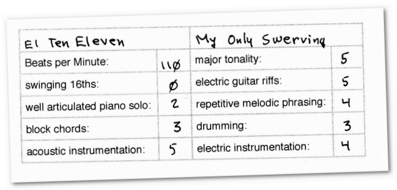
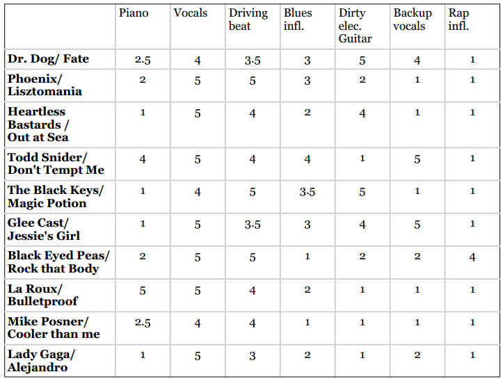
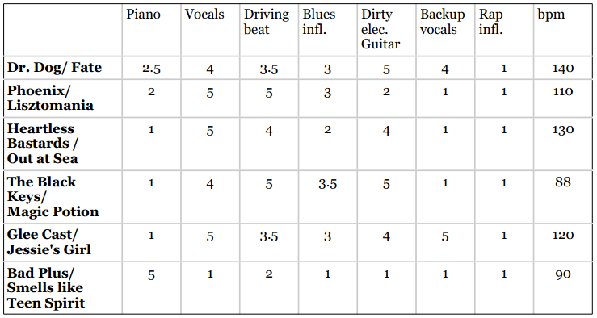
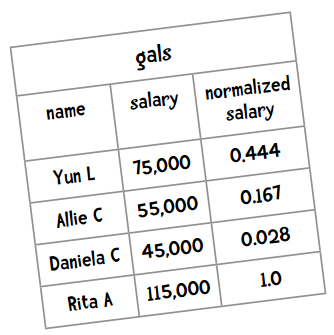
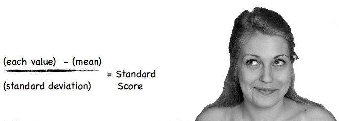
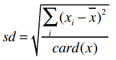
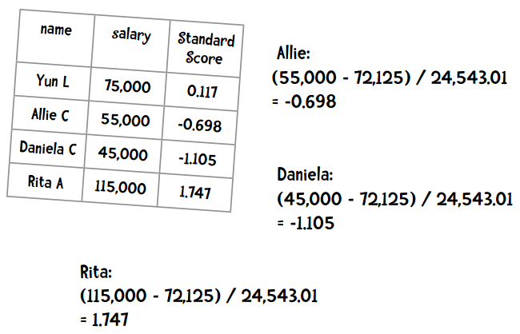
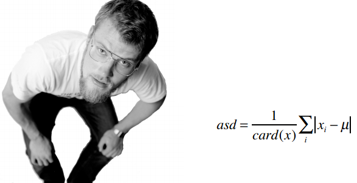

第四章：分类
============

在上几章中我们使用用户对物品的评价来进行推荐，这一章我们将使用物品本身的特征来进行推荐。这也是潘多拉音乐站所使用的方法。

内容：

* 潘多拉推荐系统简介
* 特征值选择的重要性
* 示例：音乐特征值和邻域算法
* 数据标准化
* 修正的标准分数
* Python代码：音乐，特征，以及简单的邻域算法实现
* 一个和体育相关的示例
* 特征值抽取方式一览

## 根据物品特征进行分类

前几章我们讨论了如何使用协同过滤来进行推荐，由于使用的是用户产生的各种数据，因此又称为社会化过滤算法。比如你购买了Phoenix专辑，我们网站上其他购买过这张专辑的用户还会去购买Vampire的专辑，因此会把它推荐给你；我在Netflix上观看了Doctor Who，网站会向我推荐Quantum Leap，用的是同样的原理。我们同时也讨论了协同过滤会遇到的种种问题，包括数据的稀疏性和算法的可扩展性。此外，协同过滤算法倾向于推荐那些已经很流行的物品。试想一个极端的例子：一个新乐队发布了专辑，这张专辑还没有被任何用户评价或购买过，那它将永远不会出现在推荐列表中。

> **这类推荐系统会让流行的物品更为流行，冷门的物品更无人问津。**

> -- Daniel Fleder & Kartik Hosanagar 2009 《推荐系统对商品分类的影响》

这一章我们来看另一种推荐方法。以潘多拉音乐站举例，在这个站点上你可以设立各种音乐频道，只需为这个频道添加一个歌手，潘多拉就会播放和这个歌手风格相类似的歌曲。比如我添加了Phoenix乐队，潘多拉便会播放El Ten Eleven的歌曲。它并没有使用协同过滤，而是通过计算得到这两个歌手的音乐风格是相似的。其实在播放界面上可以看到推荐理由：


“根据你目前告知的信息，我们播放的这首歌曲有着相似的旋律，使用了声响和电音的组合，即兴的吉他伴奏。”在我的Hiromi音乐站上，潘多拉会播放E.S.T.的歌曲，因为“它有着古典爵士乐风，一段高水准的钢琴独奏，轻盈的打击乐，以及有趣的歌曲结构。”


潘多拉网站的推荐系统是基于一个名为音乐基因的项目。他们雇佣了专业的音乐家对歌曲进行分类（提取它们的“基因”）。这些音乐家会接受超过150小时的训练，之后便可用20到30分钟的时间来分析一首歌曲。这些乐曲特征是很专业的：



这些专家要甄别400多种特征，平均每个月会有15000首新歌曲，因此这是一项非常消耗人力的工程。

> 注意：潘多拉的音乐基因项目是商业机密，我不曾了解它的任何信息。下文讲述的是如何构造一个类似的系统。

### 特征值选取的重要性

假设潘多拉会用曲风和情绪作为歌曲特征，分值如下：

* 曲风：乡村1分，爵士2分，摇滚3分，圣歌4分，饶舌5分
* 情绪：悲伤的1分，欢快的2分，热情的3分，愤怒的4分，不确定的5分

比如James Blunt的那首You're Beautiful是悲伤的摇滚乐，用图表来展示它的位置便是：


比如一个叫Tex的用户喜欢You're Beautiful这首歌，我们想要为他推荐歌曲。


我们的歌曲库中有另外三首歌：歌曲1是悲伤的爵士乐；歌曲2是愤怒的圣歌；歌曲3是愤怒的摇滚乐。你会推荐哪一首？


图中歌曲1看起来是最相近的。也许你已经看出了这种算法中的不足，因为不管用何种计算距离的公式，爵士乐和摇滚乐是相近的，悲伤的乐曲和快乐的乐曲是相近的等等。即使调整了分值的分配，也不能解决问题。这就是没有选取好特征值的例子。不过解决的方法也很简单，我们将每种歌曲类型拆分成单独的特征，并对此进行打分：


“乡村音乐”一栏的1分表示完全不是这个乐曲风格，5分则表示很相符。这样一来，评分值就显得有意义了。如果一首歌的“乡村音乐”特征是4分，另一首是5分，那我们可以认为它们是相似的歌曲。

其实这就是潘多拉所使用的特征抽取方法。每个特征都是1到5分的尺度，0.5分为一档。特征会被分到不同的大类中。通过这种方式，潘多拉将每首歌曲都抽象成一个包含400个数值元素的向量，并结合我们之前学过的距离计算公式进行推荐。

### 一个简单的示例

我们先来构建一个数据集，我选取了以下这些特征（可能比较随意），使用5分制来评分（0.5分一档）：

* 使用钢琴的程度（Piano）：1分表示没有使用钢琴，5分表示整首歌曲由钢琴曲贯穿；
* 使用美声的程度（Vocals）：标准同上
* 节奏（Driving beat）：整首歌曲是否有强烈的节奏感
* 蓝调（Blues infl.）
* 电音吉他（Dirty elec. Guitar）
* 幕后和声（Backup vocals）
* 饶舌（Rap infl.）

使用以上标准对一些歌曲进行评分：



然后我们便可以使用距离计算公式了，比如要计算Dr. Dog的Fate歌曲和Phoenix的Lisztomania之间的曼哈顿距离：


相加得到两首歌曲的曼哈顿距离为9。

### 使用Python实现推荐逻辑

回忆一下，我们在协同过滤中使用的用户评价数据是这样的：

```python
users = {"Angelica": {"Blues Traveler": 3.5, "Broken Bells": 2.0, "Norah Jones": 4.5, "Phoenix": 5.0, "Slightly Stoopid": 1.5, "The Strokes": 2.5, "Vampire Weekend": 2.0},
         "Bill":{"Blues Traveler": 2.0, "Broken Bells": 3.5, "Deadmau5": 4.0, "Phoenix": 2.0, "Slightly Stoopid": 3.5, "Vampire Weekend": 3.0}}
```

我们将上文中的歌曲特征数据也用类似的格式储存起来：

```python
music = {"Dr Dog/Fate": {"piano": 2.5, "vocals": 4, "beat": 3.5, "blues": 3, "guitar": 5, "backup vocals": 4, "rap": 1},
         "Phoenix/Lisztomania": {"piano": 2, "vocals": 5, "beat": 5, "blues": 3, "guitar": 2, "backup vocals": 1, "rap": 1},
         "Heartless Bastards/Out at Sea": {"piano": 1, "vocals": 5, "beat": 4, "blues": 2, "guitar": 4, "backup vocals": 1, "rap": 1},
         "Todd Snider/Don't Tempt Me": {"piano": 4, "vocals": 5, "beat": 4, "blues": 4, "guitar": 1, "backup vocals": 5, "rap": 1},
         "The Black Keys/Magic Potion": {"piano": 1, "vocals": 4, "beat": 5, "blues": 3.5, "guitar": 5, "backup vocals": 1, "rap": 1},
         "Glee Cast/Jessie's Girl": {"piano": 1, "vocals": 5, "beat": 3.5, "blues": 3, "guitar":4, "backup vocals": 5, "rap": 1},
         "La Roux/Bulletproof": {"piano": 5, "vocals": 5, "beat": 4, "blues": 2, "guitar": 1, "backup vocals": 1, "rap": 1},
         "Mike Posner": {"piano": 2.5, "vocals": 4, "beat": 4, "blues": 1, "guitar": 1, "backup vocals": 1, "rap": 1},
         "Black Eyed Peas/Rock That Body": {"piano": 2, "vocals": 5, "beat": 5, "blues": 1, "guitar": 2, "backup vocals": 2, "rap": 4},
         "Lady Gaga/Alejandro": {"piano": 1, "vocals": 5, "beat": 3, "blues": 2, "guitar": 1, "backup vocals": 2, "rap": 1}}
```

假设我有一个朋友喜欢Black Keys Magic Potion，我便可根据曼哈顿距离来进行推荐：

```python
>>> computeNearestNeighbor('The Black Keys/Magic Potion', music)
[(4.5, 'Heartless Bastards/Out at Sea'), (5.5, 'Phoenix/Lisztomania'), (6.5, 'Dr Dog/Fate'), (8.0, "Glee Cast/Jessie's Girl"), (9.0, 'Mike Posner'), (9.5, 'Lady Gaga/Alejandro'), (11.5, 'Black Eyed Peas/Rock That Body'), (11.5, 'La Roux/Bulletproof'), (13.5, "Todd Snider/Don't Tempt Me")]
```

这里我推荐的是Heartless Bastard的Out as Sea，还是很合乎逻辑的。当然，由于我们的数据集比较小，特征和歌曲都不够丰富，因此有些推荐结果并不太好。

这段代码可以[点此浏览](code/chapter-4/filteringdata.py)。

### 如何显示“推荐理由”？

潘多拉在推荐歌曲时会显示推荐理由，我们也可以做到这一点。比如在上面的例子中，我们可以将Magic Potion和Out at Sea的音乐特征做一个比较，找出高度相符的点：


可以看到，两首歌曲最相似的地方是钢琴、和声、以及饶舌，这些特征的差异都是0。但是，这些特征的评分都很低，我们不能告诉用户“因为这首歌曲没有钢琴伴奏，所以我们推荐给你”。因此，我们需要使用那些相似的且评分较高的特征。


**我们推荐歌曲是因为它有着强烈的节奏感，美声片段，以及电音吉他的演奏。**

### 评分标准的问题

假如我想增加一种音乐特征——每分钟的鼓点数（bpm），用来判断这是一首快歌还是慢歌。以下是扩充后的数据集：



没有bpm时，Magic Potion和Out at Sea距离最近，和Smells Like Teen Spirit距离最远。但引入bpm后，我们的结果就乱套了，因为bpm基本上就决定了两首歌的距离。现在Bad Plus和The Black Keys距离最近就是因为bpm数据相近。

再举个有趣的例子。在婚恋网站上，我通过用户的年龄和收入来进行匹配：


这样一来，年龄的最大差异是28，而薪资的最大差异则是72,000。因为差距悬殊，薪水的高低基本决定了匹配程度。如果单单目测，我们会将David推荐给Yun，因为他们年龄相近，工资也差不多。但如果使用距离计算公式，那么53岁的Brian就会被匹配给Yun，这就不太妙了。


**事实上，评分标准不一是所有推荐系统的大敌！**

### 标准化

**不用担心，我们可以使用标准化。**


要让数据变得可用我们可以对其进行标准化，最常用的方法是将所有数据都转化为0到1之间的值。

拿上面的薪酬数据举例，最大值115,000和最小值43,000相差72,000，要让所有值落到0到1之间，可以将每个值减去最小值，并除以范围（72,000）。所以，Yun标准化之后的薪水是：


对一些数据集，这种简单的方法效果是不错的。



如果你学过统计学，会知道还有其他的标准化方法。比如说标准分（z-score）——分值偏离均值的程度：



标准差的计算公式是：



card(x)表示集合x中的元素个数。

> 如果你对统计学有兴趣，可以读一读《[漫话统计学](http://www.amazon.com/Manga-Guide-Statistics-Shin-Takahashi/dp/1593271891)》。

我们用上文中交友网站的数据举例。所有人薪水的总和是577,000，一共有8人，所以均值为72,125。代入标准差的计算公式：


那Yun的标准分则是：


**练习题：计算Allie、Daniela、Rita的标准分**



### 标准分带来的问题

标准分的问题在于它会受异常值的影响。比如说一家公司有100名员工，普通员工每小时赚10美元，而CEO一年能赚600万，那全公司的平均时薪为：


结果是每小时38美元，看起来很美好，但其实并不真实。鉴于这个原因，标准分的计算公式会稍作变化。

### 修正的标准分

计算方法：将标准分公式中的均值改为中位数，将标准差改为绝对偏差。以下是绝对偏差的计算公式：



中位数指的是将所有数据进行排序，取中间的那个值。如果数据量是偶数，则取中间两个数值的均值。

下面就让我们试试吧。首先将所有人按薪水排序，找到中位数，然后计算绝对偏差：


最后，我们便可以计算得出Yun的修正标准分：


