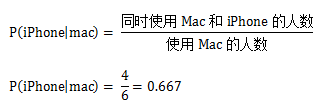

第五章：概率和朴素贝叶斯
========================

## 朴素贝叶斯

还是让我们回到运动员的例子。如果我问你Brittney Griner的运动项目是什么，她有6尺8寸高，207磅重，你会说“篮球”；我再问你对此分类的准确度有多少信心，你会回答“非常有信心”。

我再问你Heather Zurich，6尺1寸高，重176磅，你可能就不能确定地说她是打篮球的了，至少不会像之前判定Brittney那样肯定。因为从Heather的身高体重来看她也有可能是跑马拉松的。

最后，我再问你Yumiko Hara的运动项目，她5尺4寸高，95磅重，你也许会说她是跳体操的，但也不太敢肯定，因为有些马拉松运动员也是类似的身高体重。

使用近邻算法时，我们很难对分类结果的置信度进行量化。但如果使用的是基于概率的分类算法——贝叶斯算法——那就可以给出分类结果的可能性了：这名运动员有80%的几率是篮球运动员；这位病人有40%的几率患有糖尿病；拉斯克鲁塞斯24小时内有雨的概率是10%。

近邻算法又称为**被动学习**算法。这种算法只是将训练集的数据保存起来，在收到测试数据时才会进行计算。如果我们有10万首音乐，那每进行一次分类，都需要遍历这10万条记录才行。

贝叶斯算法则是一种**主动学习**算法。它会根据训练集构建起一个模型，并用这个模型来对新的记录进行分类，因此速度会快很多。

所以说，贝叶斯算法的两个优点即：能够给出分类结果的置信度；以及它是一种主动学习算法。

### 概率

相信大多数人对概率并不陌生。比如投掷一个硬币，正面出现的概率是50%；掷骰子，出现1点的概率是16.7%；从一群19岁的青少年中随机挑出一个，让你说出她是女生的可能性，你会回答50%。以上这些我们用符号P(h)来表示，即事件h发生的概率：

* 投掷硬币：P(正面) = 0.5
* 掷骰子：P(1) = 1/6
* 青少年：P(女生) = 0.5

如果我再告诉你一些额外的信息，比如这群19岁的青少年都是弗兰科学院建筑专业的学生，于是你到Google上搜索后发现这所大学的女生占86%，这时你就会改变你的答案——女生的可能性是86%。

这一情形我们用P(h|D)来表示，即D条件下事件h发生的概率。比如：

P(女生|弗兰克学院的学生) = 0.86

计算的公式是：

再举一个例子，下表是一些人使用笔记本电脑和手机的品牌：

使用iPhone的概率是多少？

如果已知这个人使用的是Mac笔记本，那他使用iPhone的概率是？

首先计算出同时使用Mac和iPhone的概率：

使用Mac的概率则是：

从而计算得到Mac用户中使用iPhone的概率：

以上是正规的解法，不过为了简单起见，我们可以直接通过计数得到：

**练习**

iPhone用户中使用Mac的概率是？

**术语**

P(h)表示事件h发生的概率，称为h的**先验概率**。在我们进行任何计算之前就已经得知人们使用Mac的概率是0.6。计算之后我们可能会得知使用Mac的人同时会使用iPhone。

P(h|d)称为**后验概率**，表示在观察了数据集d之后，h事件发生的概率是多少。比如说，我们在观察了使用iPhone的用户后可以得出他们使用Mac的概率是多少。后验概率又称为**条件概率**。

在构建一个贝叶斯分类器前，我们还需要两个概率：P(D)和P(D|h)，请看下面的示例。

## 微软购物车

你听说过微软的智能购物车吗？没错，他们真有这样的产品。这个产品是微软和一个名为Chaotic Moon的公司合作开发的。这家公司的标语是“我们比你聪明，我们比你有创造力。”你可以会觉得这样的标语有些狂妄自大，这里暂且不谈。这种购物车由以下几个部分组成：Windows 8平板电脑、Kinect体感设备、蓝牙耳机（购物车可以和你说话）、以及电动装置（购物车可以跟着你走）。

你走进一家超市，持有一张会员卡，智能购物车会识别出你，它会记录你的购物记录（当然也包括其他人的）。

智能购物车也会显示广告（比如日本的Sensha绿茶），不过它只会向那些有可能购买此物品的用户进行展示。

以下是一些数据示例：

**P(D)**表示从训练集数据中计算得到的概率，比如上表中邮编为88005的概率是：

P(88005) = 0.5

**P(D|h)**表示在一定条件下的观察结果。比如说购买过Sencha绿茶的人中邮编为88005的概率为：

**练习**

没有买Sencha的人中邮编为88005的概率是？

*上式中的“┐”表示取反*

邮编为88001的概率是？

P(88001) = 0.3

购买了Sencha的人中邮编为88001的概率？

没有购买Sencha的人中邮编为88001的概率？

## 贝叶斯法则

贝叶斯法则描述了P(h)、P(h|D)、P(D)、以及P(D|h)这四个概率之间的关系：

这个公式是贝叶斯方法论的基石。在数据挖掘中，我们通常会使用这个公式去判别不同事件之间的关系。我们可以计算得到在某些条件下这位运动员是从事体操、马拉松、还是篮球项目的；也可以计算得到某些条件下这位客户是否会购买Sencha绿茶等。我们会通过计算不同事件的概率来得出结论。

比如说我们要决定是否给一位客户展示Sencha绿茶的广告，已知他所在的地区邮编是88005。我们有两个相反的假设：

* 这位用户会购买Sencha绿茶的概率，即：P(购买|88005)；
* 不会购买的概率：P(┐购买|88005)。

假设我们计算得到P(购买|88005) = 0.6，而P(┐购买|88005) = 0.4，则可以认为用户会购买，从而显示相应的广告。

再比如我们要为一家销售电子产品的公司发送宣传邮件，共有笔记本、台式机、平板电脑三种产品。我们需要根据目标用户的类型来分别派送这三种宣传邮件。比如我们有一位居住在88005地区的女士，她的女儿在读大学，并居住在家中，而且她还会参加瑜伽课程。那我应该派发哪种邮件呢？

让我们用D来表示这位客户的特征：

* 居住在88005地区
* 有一个正在读大学的女儿
* 练习瑜伽

因此我们需要计算以下三个概率：

并选择概率最大的结果。

再抽象一点，如果我们有h1, h2, ...hn等事件，它们就相当于不同的类别（篮球、体操、或是有没有患糖尿病等）。

在计算出以上这些概率后，选取最大的结果，就能用作分类了。这种方法叫最大后验估计，记为hMAP。

我们可以用以下公式来表示最大后验估计：

H表示所有的事件，所以h∈H表示“对于集合中的每一个事件”。整个公式的含义就是：对于集合中的每一个事件，计算出P(h|D)的值，并取最大的结果。使用贝叶斯法则进行替换：

所以我们需要计算的就是以下这个部分：

可以发现对于所有的事件，公式中的分母都是P(D)，因此即便只计算P(D|h)P(h)，也可以判断出最大的结果。那么这个公式就可以简化为：

作为演示，我们选取Tom M. Mitchell《机器学习》中的例子。Tom是卡耐基梅隆大学机器学习部的首席，也是非常友好的一个人。这个例子是通过一次血液检验来判断某人是否患有某种癌症。已知这种癌症在美国的感染率是0.8%。血液检验的结果有阳性和阴性两种，且存在准确性的问题：如果这个人患有癌症，则有98%的几率测出阳性；如果他没有癌症，会有97%的几率测出阴性。
