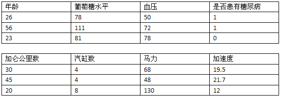
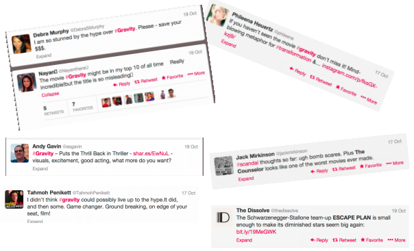
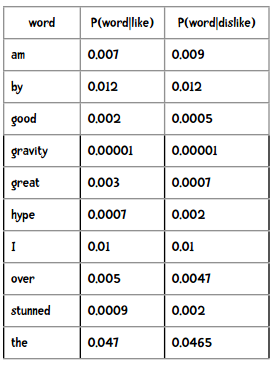
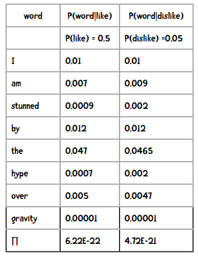

第七章：朴素贝叶斯和文本数据
============================

原文：http://guidetodatamining.com/chapter-7/

## 非结构化文本的分类算法

在前几个章节中，我们学习了如何使用人们对物品的评价（五星、顶和踩）来进行推荐；还使用了他们的隐式评价——买过什么，点击过什么；我们利用特征来进行分类，如身高、体重、对法案的投票等。这些数据有一个共性——能用表格来展现：



因此这类数据我们称为“结构化数据”——数据集中的每条数据（上表中的一行）由多个特征进行描述（上表中的列）。而非结构化的数据指的是诸如电子邮件文本、推特信息、博客、新闻等。这些数据至少第一眼看起来是无法用一张表格来展现的。

举个例子，我们想从推特信息中获取用户对各种电影的评价：



可以看到，Andy Gavin喜欢看地心引力，因为他的消息中有“不寒而栗”、“演的太棒了”之类的文本。而Debra Murphy则不太喜欢这部电影，因为她说“还是省下看这部电影的钱吧”。如果有人说“我太想看这部电影了，都兴奋坏了！”，我们可以看出她是喜欢这部电影的，即使信息中有“坏”这个字。

我在逛超市时看到一种叫Chobani的酸奶，名字挺有趣的，但真的好吃吗？于是我掏出iPhone，谷歌了一把，看到一篇名为“女人不能只吃面包”的博客：

> **无糖酸奶品评**

> 你喝过Chobani酸奶吗？如果没有，就赶紧拿起钥匙出门去买吧！虽然它是脱脂原味的，但喝起来和酸奶的口感很像，致使我每次喝都有负罪感，因为这分明就是在喝全脂酸奶啊！原味的感觉很酸很够味，你也可以尝试一下蜂蜜口味的。我承认，虽然我在减肥期间不该吃蜂蜜的，但如果我有一天心情很糟想吃甜食，我就会在原味酸奶里舀一勺蜂蜜，太值得了！至于那些水果味的，应该都有糖分在里面，但其实酸奶本身就已经很美味了，水果只是点缀。如果你家附近没有Chobani，也可以试试Fage，同样好吃。

> 虽然需要花上一美元不到，而且还会增加20卡路里，但还是很值得的，毕竟我已经一下午没吃东西了！

> *http://womandoesnotliveonbreadalone.blogspot.com/2009/03/sugar-free-yogurt-reviews.html*

这是一篇正面评价吗？从第二句就可以看出，作者非常鼓励我去买。她还用了“够味”、“美味”等词汇，这些都是正面的评价。所以，让我先去吃会儿……


### 自动判别文本中的感情色测


> 约翰，这条推文应该是称赞地心引力的！

假设我们要构建一个自动判别文本感情色彩的系统，它有什么作用呢？比如说有家公司是售卖健康检测设备的，他们想要知道人们对这款产品的反响如何。他们投放了很多广告，顾客是喜欢（我好想买一台）还是讨厌（看起来很糟糕）呢？再比如苹果公司召开了一次新闻发布会，讨论iPhone现有的问题，结果是正面的还是负面的呢？一位参议会议员对某个法案做了一次公开演讲，那些政治评论家的反应如何？看来这个系统还是有些作用的。


> 那要怎样构建一套这样的系统呢？

假设我要从文本中区分顾客对某些食品的喜好，可能就会列出一些表达喜欢的词语，以及表达厌恶的词：

* 表达喜欢的词：美味、好吃、不错、喜欢、可口
* 表达厌恶的词：糟糕、难吃、不好、讨厌、恶心

比如我们想知道某篇评论对Chobani酸奶的评价是正面的还是负面的，我们可以去统计评论中表达喜欢和厌恶的词的数量，看哪种类型出现的频率高。这种方法也可以应用到其他分类中，比如判断某个人是否支持堕胎，如果他的言论中经常出现“未出生的小孩”，那他很可能是反堕胎的；如果言论中出现“胎儿”这个词比较多，那有可能是支持堕胎的。其实，用词语出现的数量来进行分类还是很容易想到的。


我们可以使用朴素贝叶斯算法来进行分类，而不是一般的计数。先来回忆一下公式：


argmax表示选取概率最大的分类；h∈H表示计算每个事件的概率；P(D|h)表示在给定h的条件下，D发生的概率（如给定某类文章，这类文章中特定单词出现的概率）；P(h)则指事件h发生的概率。

我们的训练集是一组文本，又称为**语料库**。每个文本（即每条记录）是一则140字左右的推文，并被标记为喜欢和讨厌两类。P(h)表示的就是喜欢和讨厌出现的概率。我们的训练集中有1000条记录，喜欢和讨厌各有500条，因此它们的概率是：

```
P(喜欢) = 0.5
P(讨厌) = 0.5
```


> 当我们使用已经标记好分类的数据集进行训练时，这种类型的机器学习称为“监督式学习”。文本分类就是监督式学习的一种。

> 如果训练集没有标好分类，那就称为“非监督式学习”，聚类就是一种非监督式学习，我们将在下一章讲解。

> 还有一些算法结合了监督式和非监督式，通常是在初始化阶段使用分类好的数据，之后再使用未分类的数据进行学习。

让我们回到上面的公式，首先来看P(D|h)要如何计算——在正面评价中，单词D出现的概率。比如说“Puts the Thrill back in Trhiller”这句话，我们可以统计所有表达“喜欢”的文章中第一个单词是“Puts”的概率，第二个单词是“the”的概率，以此类推。接着我们再计算表达“讨厌”的文章中第一个单词是“Puts”的概率，第二个单词是“the”的概率等等。


> 谷歌曾统计过英语中大约有一百万的词汇，如果一条推文中有14个单词，那我们就需要计算1,000,000<sup>14</sup>个概率了，显然是不现实的。

的确，这种方法并不可行。我们可以简化一下，不考虑文本中单词的顺序，仅统计表达“喜欢”的文章中某个单词出现的概率。以下是统计方法。

## 训练阶段

首先，我们统计所有文本中一共出现了多少个不同的单词，记作“|Vocabulary|”（总词汇表）。对于每个单词w<sub>k</sub>，我们将计算P(w<sub>k</sub>|h<sub>i</sub>)，每个h<sub>i</sub>（喜欢和讨厌两种）的计算步骤如下：

1. 将该分类下的所有文章合并到一起；
2. 统计每个单词出现的数量，记为n；
3. 对于总词汇表中的单词w<sub>k</sub>，统计他们在本类文章中出现的次数n<sub>k</sub>：
4. 最后应用下方的公式：


## 使用朴素贝叶斯进行分类

分类阶段比较简单，直接应用贝叶斯公式就可以了，让我们试试吧！


通过训练，我们得到以下概率结果：



比如下面这句话，要如何判断它是正面还是负面的呢？

> I am stunned by the hype over gravity.

我们需要计算的是下面两个概率，并选取较高的结果：

```
P(like)×P(I|like)×P(am|like)×P(stunned|like)×...
P(dislike)×P(I|dislike)×P(am|dislike)×P(stunned|dislike)×...
```



因此分类的结果是“讨厌”。

**提示** 结果中的6.22E-22是科学计数法，等价于6.22×10<sup>-22</sup>。


> 哇，这个概率也太小了吧！

> 是的，如果文本中有100个单词，那乘出来的概率就会更小。

> 但是Python不能处理那么小的小数，最后都会变成零的。

> 没错，因此我们要用对数来算——将每个概率的对数相加！

假设一个包含100字的文本中，每个单词的概率是0.0001，那么计算结果是：

```python
>>> 0.0001 ** 100
0.0
```

如果我们用对数相加来运算的话：

```python
>>> import math
>>> p = 0
>>> for i in range(100):
...     p += math.log(0.0001)
... 
>>> p
-921.034037197617
```

**提示**

* b<sup>n</sup> = x 可以转换为 log<sub>b</sub>x = n
* log<sub>10</sub>(ab) = log<sub>10</sub>(a) + log<sub>10</sub>(b)

## 新闻组语料库

我们下面要处理的数据集是新闻，这些新闻可以分为不同的新闻组，我们会构造一个分类器来判断某则新闻是属于哪个新闻组的：


比如下面这则新闻是属于rec.motorcycles组的：


注意到这则新闻中还有一些拼写错误（如accesories、ussually等），这对分类器是一个不小的挑战。

这些数据集都来自 http://qwone.com/~jason/20Newsgroups/ （我们使用的是20news-bydate数据集），你也可以从 [这里](http://guidetodatamining.com/guide/data/20news-bydate.zip) 获得。这个数据集包含18,846个文档，并将训练集（60%）和测试集放在了不同的目录中，每个子目录都是一个新闻组，目录中的文件即新闻文本。
