第八章：聚类
============

原文：http://guidetodatamining.com/chapter-8/

前几章我们学习了如何构建分类系统，使用的是已经标记好类别的数据集进行训练：


训练完成后我们就可以用来预测了：这个人看起来像是篮球运动员，那个人可能是练体操的；这个人三年内不会患有糖尿病。

可以看到，分类器在训练阶段就已经知道各个类别的名称了。那如果我们不知道呢？如何构建一个能够自动对数据进行分组的系统？比如有1000人，每人有20个特征，我想把这些人分为若干个组。


这个过程叫做聚类：通过物品特征来计算距离，并自动分类到不同的群集或组中。有两种聚类算法比较常用：

**k-means聚类算法**

我们会事先告诉这个算法要将数据分成几个组，比如“请把这1000个人分成5个组”，“将这些网页分成15个组”。这种方法就叫k-means，我们会在后面的章节讨论。

## 层次聚类法

对于层次聚类法，我们不需要预先指定分类的数量，这个算方法会将每条数据都当作是一个分类，每次迭代的时候合并距离最近的两个分类，直到剩下一个分类为止。因此聚类的结果是：顶层有一个大分类，这个分类下有两个子分类，每个子分类下又有两个子分类，依此类推，层次聚类也因此得命。


在合并的时候我们会计算两个分类之间的距离，可以采用不同的方法。如下图中的A、B、C三个分类，我们应该将哪两个分类合并起来呢？

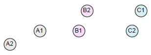

### 单链聚类

在单链聚类中，分类之间的距离由两个分类相距最近的两个元素决定。如上图中分类A和分类B的距离由A1和B1的距离决定，因为这个距离小于A1到B2、A2到B1的距离。这样一来我们会将A和B进行合并。

### 全链聚类

在全链聚类中，分类之间的距离由两个分类相距最远的两个元素决定。因此上图中分类A和B的距离是A2到B2的距离，最后会将分类B和C进行合并。

### 平均链接聚类

在这种聚类方法中，我们通过计算分类之间两两元素的平均距离来判断分类之间的距离，因此上图中会将分类B和C进行合并。


> 下面让我们用单链聚类法举个例子吧！

我们来用狗的高度和重量来进行聚类：


> 在计算距离前我们是不是忘了做件事？


> 标准化！我们先将这些数据转换为修正的标准分。


然后我们计算欧几里德距离，图中高亮了一些最短距离：


根据下面的图表，你能看出哪两个品种的距离最近吗？


> 如果你看出是Border Collie和Portuguese Water Dog最近，那就对了！

**计算过程**

第一步：我们找到距离最近的两个元素，对他们进行聚类：


第二步：再找出距离最近的两个元素，进行聚类：


第三步：继续重复上面的步骤：

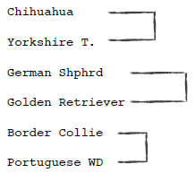

第四步：继续查找距离最近的元素，发现Border Collie已经属于一个分类的，因此进行如下图所示的合并：

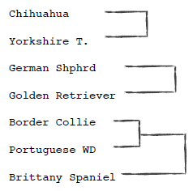

> 这叫树状图，可以用来表示聚类。

**动手实践**

你能在下图的基础上继续完成聚类吗？


**解答**

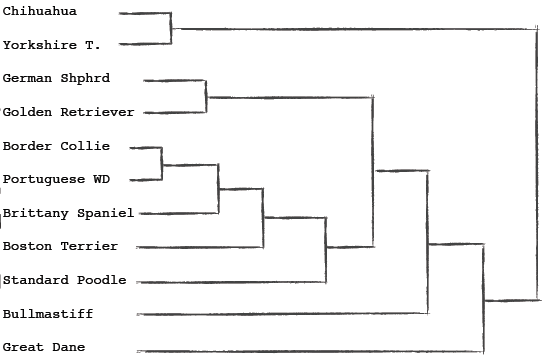

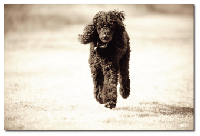

## 编写层次聚类算法


> 我们可以使用优先队列来实现这个聚类算法。

> 什么是优先队列呢？

普通的队列有“先进先出”的规则，比如向队列先后添加Moa、Suzuka、Yui，取出时得到的也是Moa、Suzuka、Yui：


而对于优先队列，每个元素都可以附加一个优先级，从队列中取出时会得到优先级最高的元素。比如说，我们定义年龄越小优先级越高，以下是插入过程：

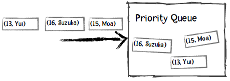

取出的第一个元素是Yui，因为她的年龄最小：


我们看看Python中如何使用优先队列：

```python
>>> from Queue import PriorityQueue           # 加载优先队列类
>>> singersQueue = PriorityQueue()            # 创建对象
>>> singersQueue.put((16, 'Suzuka Nakamoto')) # 插入元素
>>> singersQueue.put((15, 'Moa Kikuchi'))
>>> singersQueue.put((14, 'Yui Mizuno'))
>>> singersQueue.put((17, 'Ayaka Sasaki'))
>>> singersQueue.get() # 获取第一个元素，即最年轻的歌手Yui。
(14, 'Yui Mizuno')
>>> singersQueue.get()
(15, 'Moa Kikuchi')
>>> singersQueue.get()
(16, 'Suzuka Nakamoto')
>>> singersQueue.get()
(17, 'Ayaka Sasaki')
```

在进行聚类时，我们将分类、离它最近的分类、以及距离插入到优先队列中，距离作为优先级。比如上面的犬种示例，Border Collie最近的分类是Portuguese WD，距离是0.232：

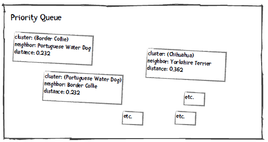

我们将优先队列中距离最小的两个分类取出来，合并成一个分类，并重新插入到优先队列中。比如下图是将Border Collie和Portuguese WD合并后的结果：

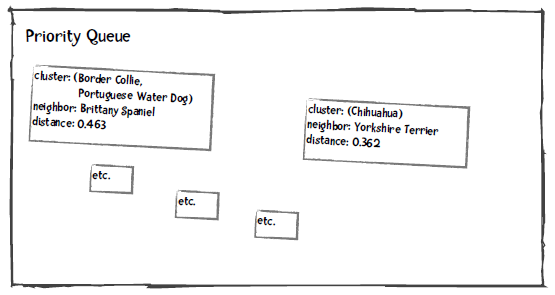

重复这个过程，直到队列中只有一个元素为止。当然，我们插入的数据会复杂一些，请看下面的讲解。

### 从文件中读取数据

数据文件是CSV格式的（以逗号分隔），第一行是列名，第一列是犬种，第二列之后是特征值：

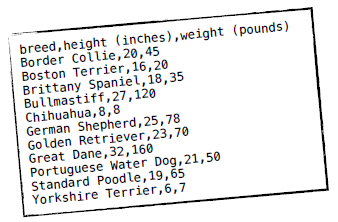

我们用Python的列表结构来存储这些数据，data[0]用来存放所有记录的分类，如data[0][0]是Border Collie，data[0][1]是Boston Terrier。data[1]则是所有记录的高度，data[2]是重量。特征列的数据都会转换成浮点类型，如data[1][0]是20.0，data[2][0]是45.0等。在读取数据时就需要对其进行标准化。此外，我们接下来会使用“下标”这个术语，如第一条记录Border Collie的下标是0，第二条记录Boston Terrier下标是1等。

### 初始化优先队列

以Border Collie为例，我们需要计算它和其它犬种的距离，保存在Python字典里：

```python
{1: ((0, 1), 1.0244),  # Border Collie（下标为0）和Boston Terrier（下标为1）之间的距离为1.0244
 2: ((0, 2), 0.463),   # Border Collie和Brittany Spaniel（下标为2）之间的距离为0.463
 ...
 10: ((0, 10), 2.756)} # Border Collie和Yorkshire Terrier的距离为2.756
```

此外，我们会记录Border Collie最近的分类及距离：这对犬种是(0, 8)，即下标为0的Border Collie和下标为8的Portuguese WD，距离是0.232。

#### 距离相等的问题以及为何要使用元组

你也许注意到了，Portuguese WD和Standard Poodle的距离是0.566，Boston Terrier和Brittany Spaniel的距离也是0.566，如果我们通过最短距离来取，很可能会取出Standard Poodle和Boston Terrier进行组合，这显然是错误的，所以我们才会使用元组来存放这对犬种的下标，以作判断。比如说，Portuguese WD的记录是：

```python
['Portuguese Water Dog', 0.566, (8, 9)]
```

它的近邻Standard Poodle的记录是：

```python
['Standard Poodle', 0.566, (8, 9)]
```

我们可以通过这个元组来判断这两条记录是否是一对。

#### 距离相等的另一个问题

在介绍优先队列时，我用了歌手的年龄举例，如果他们的年龄相等，取出的顺序又是怎样的呢？

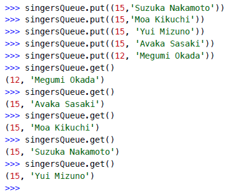

可以看到，如果年龄相等，优先队列会根据记录中的第二个元素进行判断，即歌手的姓名，并按字母顺序返回，如Avaka会比Moa优先返回。

在犬种示例中，我们让距离成为第一优先级，下标成为第二优先级。因此，我们插入到优先队列的一条完整记录是这样的：

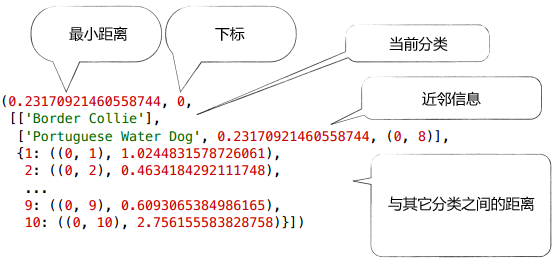

### 重复下述步骤，直到仅剩一个分类

我们从优先队列中取出两个元素，对它们进行合并。如合并Border Collie和Portuguese WD后，会形成一个新的分类：

```python
['Border Collie', 'Portuguese WD']
```

然后我们需要计算新的分类和其它分类之间的距离，方法是对取出的两个分类的距离字典进行合并。如第一个分类的距离字段是distanceDict1，第二个分类的是distanceDict2，新的距离字段是newDistanceDict：

```
初始化newDistanceDict
对于distanceDict1的每一个键值对:
    如果这个键在distanceDict2中存在:
        如果这个键在distanceDict1中的距离要比在distanceDict2中的距离小:
            将distanceDict1中的距离存入newDistanceDict
        否则:
            将distanceDict2中的距离存入newDistanceDict
```

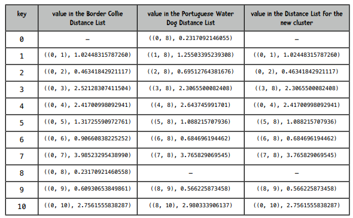

经过计算后，插入到优先队列中的新分类的完整记录是：


**代码实践**

你能将上面的算法用Python实现吗？你可以从[hierarchicalClustererTemplate.py](code/chapter-8/hierarchicalClustererTemplate.py)这个文件开始，完成以下步骤：

1. 编写init方法，对于每条记录：
    1. 计算该分类和其它分类之间的欧几里得距离；
    2. 找出该分类的近邻；
    3. 将这些信息放到优先队列的中。
2. 编写cluster方法，重复以下步骤，直至剩下一个分类：
    1. 从优先队列中获取两个元素；
    2. 合并；
    3. 将合并后的分类放回优先队列中。

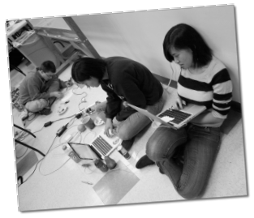

**解答**

> 注意，我的实现并不一定是最好的，你可以写出更好的！

```python
from queue import PriorityQueue
import math

"""
层次聚类示例代码
"""

def getMedian(alist):
    """计算中位数"""
    tmp = list(alist)
    tmp.sort()
    alen = len(tmp)
    if (alen % 2) == 1:
        return tmp[alen // 2]
    else:
        return (tmp[alen // 2] + tmp[(alen // 2) - 1]) / 2

def normalizeColumn(column):
    """计算修正的标准分"""
    median = getMedian(column)
    asd = sum([abs(x - median) for x in column]) / len(column)
    result = [(x - median) / asd for x in column]
    return result

class hClusterer:
    """该聚类器默认数据的第一列是标签，其它列是数值型的特征。"""
    
    def __init__(self, filename):
        file = open(filename)
        self.data = {}
        self.counter = 0
        self.queue = PriorityQueue()
        lines = file.readlines()
        file.close()
        header = lines[0].split(',')
        self.cols = len(header)
        self.data = [[] for i in range(len(header))]
        for line in lines[1:]:
            cells = line.split(',')
            toggle = 0
            for cell in range(self.cols):
                if toggle == 0:
                   self.data[cell].append(cells[cell])
                   toggle = 1
                else:
                    self.data[cell].append(float(cells[cell]))
        # 标准化特征列（即跳过第一列）
        for i in range(1, self.cols):
                self.data[i] = normalizeColumn(self.data[i])

        ###
        ###  数据已经读入内存并做了标准化，对于每一条记录，将执行以下步骤：
        ###     1. 计算该分类和其他分类的距离，如当前分类的下标是1，
        ###        它和下标为2及下标为3的分类之间的距离用以下形式表示：
        ###        {2: ((1, 2), 1.23),  3: ((1, 3), 2.3)... }
        ###     2. 找出距离最近的分类；
        ###     3. 将该分类插入到优先队列中。
        ###

        # 插入队列
        rows = len(self.data[0])              

        for i in range(rows):
            minDistance = 99999
            nearestNeighbor = 0
            neighbors = {}
            for j in range(rows):
                if i != j:
                    dist = self.distance(i, j)
                    if i < j:
                        pair = (i,j)
                    else:
                        pair = (j,i)
                    neighbors[j] = (pair, dist)
                    if dist < minDistance:
                        minDistance = dist
                        nearestNeighbor = j
                        nearestNum = j
            # 记录这两个分类的配对信息
            if i < nearestNeighbor:
                nearestPair = (i, nearestNeighbor)
            else:
                nearestPair = (nearestNeighbor, i)
                
            # 插入优先队列
            self.queue.put((minDistance, self.counter,
                            [[self.data[0][i]], nearestPair, neighbors]))
            self.counter += 1

    def distance(self, i, j):
        sumSquares = 0
        for k in range(1, self.cols):
            sumSquares += (self.data[k][i] - self.data[k][j])**2
        return math.sqrt(sumSquares)

    def cluster(self):
         done = False
         while not done:
             topOne = self.queue.get()
             nearestPair = topOne[2][1]
             if not self.queue.empty():
                 nextOne = self.queue.get()
                 nearPair = nextOne[2][1]
                 tmp = []
                 
                 ##  我从队列中取出了两个元素：topOne和nextOne，
                 ##  检查这两个分类是否是一对，如果不是就继续从优先队列中取出元素，
                 ##  直至找到topOne的配对分类为止。
                 while nearPair != nearestPair:
                     tmp.append((nextOne[0], self.counter, nextOne[2]))
                     self.counter += 1
                     nextOne = self.queue.get()
                     nearPair = nextOne[2][1]
                     
                 ## 将不处理的元素退回给优先队列
                 for item in tmp:
                     self.queue.put(item)
                     
                 if len(topOne[2][0]) == 1:
                     item1 = topOne[2][0][0]
                 else:
                     item1 = topOne[2][0]
                 if len(nextOne[2][0]) == 1:
                     item2 = nextOne[2][0][0]
                 else:
                     item2 = nextOne[2][0]
                 ##  curCluster即合并后的分类
                 curCluster = (item1, item2)

                 ## 对于这个新的分类需要做两件事情：首先找到离它最近的分类，然后合并距离字典。
                 ## 如果item1和元素23的距离是2，item2和元素23的距离是4，我们取较小的那个距离，即单链聚类。
                 minDistance = 99999
                 nearestPair = ()
                 nearestNeighbor = ''
                 merged = {}
                 nNeighbors = nextOne[2][2]
                 for (key, value) in topOne[2][2].items():
                    if key in nNeighbors:
                        if nNeighbors[key][1] < value[1]:
                             dist =  nNeighbors[key]
                        else:
                            dist = value
                        if dist[1] < minDistance:
                             minDistance =  dist[1]
                             nearestPair = dist[0]
                             nearestNeighbor = key
                        merged[key] = dist
                    
                 if merged == {}:
                    return curCluster
                 else:
                    self.queue.put( (minDistance, self.counter,
                                     [curCluster, nearestPair, merged]))
                    self.counter += 1

def printDendrogram(T, sep=3):
    """打印二叉树状图。树的每个节点是一个二元组。这个方法摘自：
    http://code.activestate.com/recipes/139422-dendrogram-drawing/"""
	
    def isPair(T):
        return type(T) == tuple and len(T) == 2
    
    def maxHeight(T):
        if isPair(T):
            h = max(maxHeight(T[0]), maxHeight(T[1]))
        else:
            h = len(str(T))
        return h + sep
        
    activeLevels = {}

    def traverse(T, h, isFirst):
        if isPair(T):
            traverse(T[0], h-sep, 1)
            s = [' ']*(h-sep)
            s.append('|')
        else:
            s = list(str(T))
            s.append(' ')

        while len(s) < h:
            s.append('-')
        
        if (isFirst >= 0):
            s.append('+')
            if isFirst:
                activeLevels[h] = 1
            else:
                del activeLevels[h]
        
        A = list(activeLevels)
        A.sort()
        for L in A:
            if len(s) < L:
                while len(s) < L:
                    s.append(' ')
                s.append('|')

        print (''.join(s))    
        
        if isPair(T):
            traverse(T[1], h-sep, 0)

    traverse(T, maxHeight(T), -1)


filename = '/Users/raz/Dropbox/guide/data/dogs.csv'

hg = hClusterer(filename)
cluster = hg.cluster()
printDendrogram(cluster)
```

运行结果和我们手算的一致：

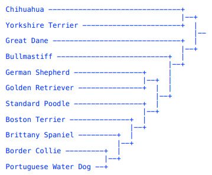

**动手实践**

[这里](code/chapter-8/cereal.csv)提供了77种早餐麦片的营养信息，包括以下几项：

* 麦片名称
* 热量
* 蛋白质
* 脂肪
* 纳
* 纤维
* 碳水化合物
* 糖
* 钾
* 维生素

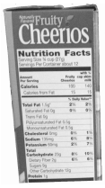

请对这个数据集进行层次聚类：

* 哪种麦片和Trix最相近？
* 与Muesli Raisins & Almonds最相近的是？

> 数据集来自：http://lib.stat.cmu.edu/DASL/Datafiles/Cereals.html

**结果**

我们只需将代码中的文件名替换掉就可以了，结果如下：

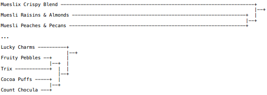

因此Trix和Fruity Pebbles最相似（你可以去买这两种麦片尝尝）。Muesli Raisins & Almonds和Muesli Peaches & Pecans最相似。


> 好了，这就是层次聚类算法，很简单吧！

## k-means聚类算法

使用k-means算法时需要指定分类的数量，这也是算法名称中“k”的由来。


> k-means是Lloyd博士在1957年提出的，虽然这个算法已有50年的历史，但却是当前最流行的聚类算法！

下面让我们来了解一下k-means聚类过程：

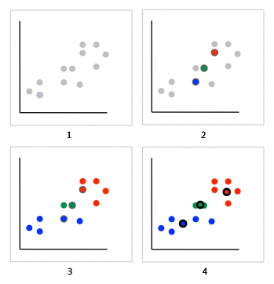

1. 我们想将图中的记录分成三个分类（即k=3），比如上文提到的犬种数据，坐标轴分别是身高和体重。
2. 由于k=3，我们随机选取三个点来作为聚类的起始点（分类的中心点），并用红黄蓝三种颜色标识。
3. 然后，我们根据其它点到中心点的距离来进行分配，这样就能将这些点分成三类了。
4. 计算这些分类的中心点，以此作为下一次计算的起始点。重复这个过程，直到中心点不再变动，或迭代次数超过某个阈值为止。

所以k-means算法可概括为：

1. 随机选取k个元素作为中心点；
2. 根据距离将各个点分配给中心点；
3. 计算新的中心点；
4. 重复2、3，直至满足条件。

我们来看一个示例，将以下点分成两个分类：


**第一步 随机选取中心点**

我们选取(1, 4)作为分类1的中心点，(4, 2)作为分类2的中心点；

**第二步 将各点分配给中心点**

可以用各类距离计算公式，为简单起见，这里我们使用曼哈顿距离：

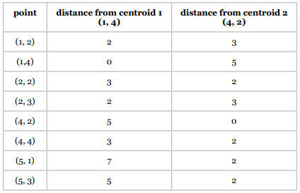

聚类结果如下：

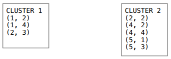

**第三步 更新中心点**

通过计算平均值来更新中心点，如x轴的均值是：

(1 + 1 + 2) / 3 = 4 / 3 = 1.33

y轴是：

(2 + 4 + 3) / 3 = 9 / 3 = 3

因此分类1的中心点是(1.33, 3)。计算得到分类2的中心点是(4, 2.4)。

**第四步 重复前面两步

两个分类的中心点由(1, 4)、(4, 2)变为了(1.33, 3)、(4, 2.4)，我们使用新的中心点重新计算。

**重复第二步 将各点分配给中心点**

同样是计算曼哈顿距离：


新的聚类结果是：


**重复第三步 更新中心点**

* 分类1：(1.5, 2.75)
* 分类2：(4.5, 2.5)

**重复第二步 将各点分配给中心点**

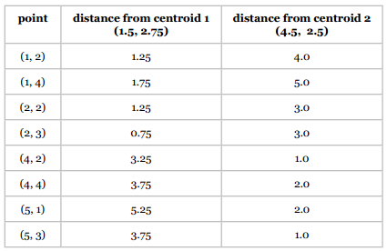


**重复第三步 更新中心点**

* 分类1：(1.5, 2.75)
* 分类2：(4.5, 2.5)

可以看到中心点并没有改变，所以计算也就结束了。


> 当中心点不再变化时，或者说不再有某个点从一个分类转移到另一个分类时，我们就会停止计算。这个时候我们称该算法已经收敛。算法运行过程中，中心点的大幅转移是在前几次迭代中产生的，后面的迭代中变动的幅度就会减小。也就是说，k-means算法的重点是在前期迭代，而后期的迭代只是细微的调整。


> 基于k-means的这种特点，我们可以将“没有点发生转移”弱化成“少于1%的点发生转移”来作为计算停止条件，这也是最普遍的做法。


> k-means好简单呀！

**扩展阅读**

k-means是一种最大期望算法，这类算法会在“期望”和“最大化”两个阶段不断迭代。比如k-means的期望阶段是将各个点分配到它们所“期望”的分类中，然后在最大化阶段重新计算中心点的位置。如果你对此感兴趣，可以前去阅读[维基百科](http://en.wikipedia.org/wiki/Expectation%E2%80%93maximization_algorithm)上的词条。
